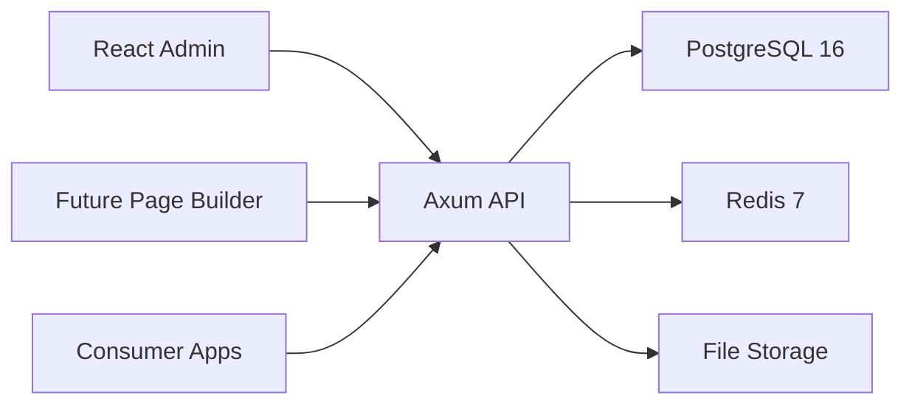

# Architecture

ZinharCMS follows the proposal's API-first headless CMS architecture.

## Layers

- Client layer: React admin panel and future visual page builder.
- API gateway layer: Axum REST API with CORS, request tracing, timeout, compression, JWT-ready middleware, and OpenAPI JSON.
- Core CMS services: auth, RBAC, content types, entries, media, page builder, and delivery modules.
- Data layer: PostgreSQL 16 for primary storage, Redis 7 for cache/session primitives, and local/S3-compatible file storage.

## Repository Layout

```text
ZinharCMS/
├── backend/               Rust/Axum API
│   ├── migrations/        SQLx PostgreSQL migrations
│   └── src/
│       ├── config.rs
│       ├── db/
│       ├── middleware/
│       ├── models/
│       ├── routes/
│       └── services/
├── frontend/              React/Vite admin workspace
│   └── src/
│       ├── components/
│       ├── hooks/
│       ├── pages/
│       ├── services/
│       └── stores/
├── docs/
├── docker-compose.yml
└── docker-compose.prod.yml
```

## Database Foundation

The initial schema implements the proposal ERD:

- `users`, `roles`, `user_roles`, `refresh_tokens`
- `content_types`, `content_entries`
- `pages`, `page_versions`, `component_registry`
- `media`, `media_variants`

Phase one adds role normalization for `super_admin` and `author`, refresh-token
rotation, and media captions.

The schema uses `UUID` primary keys, `JSONB` for dynamic content/page structures,
status enums, slug checks, foreign keys, and indexes for common lookups.

## Runtime Flow


