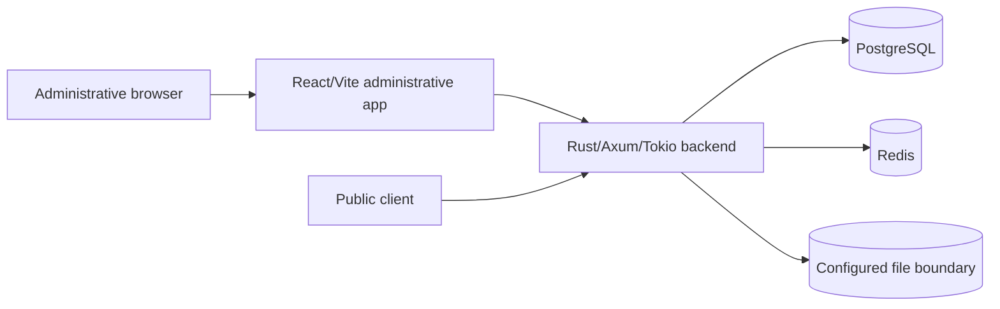
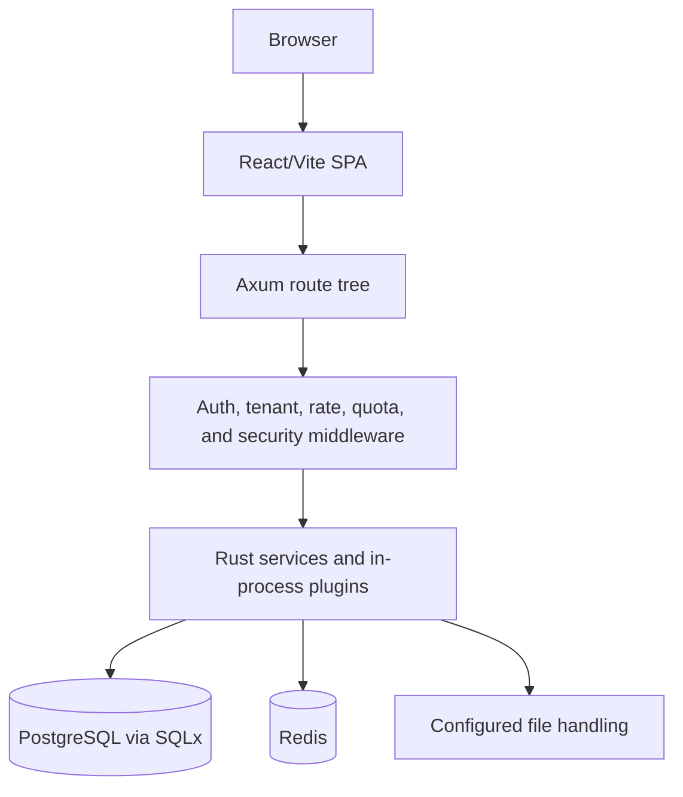

# Current composition

ZinharCMS is a modular monolith. The browser loads a React/Vite administrative
application, while one Rust/Axum/Tokio backend process composes the route,
middleware, service, plugin, database, cache, and file-handling boundaries.
The repository does not establish independent deployable microservices.

The backend initializes configuration, logging, the PostgreSQL pool, embedded
SQLx migrations, Redis, shared application state, CORS/security middleware,
compression, request identifiers, and a bounded request timeout before it
serves the Axum router. The frontend mounts the provider and session bootstrap
layers and then delegates route selection to the client router.

## Preserved visualizations

The following two Phase 1-preserved visuals are embedded here because their
repository-level meaning remains accurate for this bounded composition.

### system-context

### container-view

These diagrams intentionally omit deployment topology and external providers;
the repository evidence is not sufficient to claim those details.

The request-path split is described in [runtime and request boundaries](/architecture/runtime-and-request-boundaries.md), and the process/module view is expanded in [backend runtime](/backend/backend-runtime.md).
