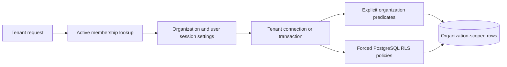

# Session context and policies

Tenant connections receive `zinhar.organization_id`, an optional
`zinhar.user_id`, and `zinhar.rls_bypass=false`. Tenant transactions set the
same values transaction-locally. The explicit bypass transaction clears the
organization and user settings and sets the bypass flag only for a deliberate
maintenance/test path; this is not evidence of a normal request mode.

The base RLS migration forces row-level security and creates operation policies
for `content_types`, `content_entries`, `pages`, `page_versions`, `media`,
`media_variants`, `comments`, `webhooks`, `webhook_deliveries`,
`public_settings`, and `navigation_items`. `component_registry` has a separate
policy: system rows may be selected, while writes require a non-system row in
the current organization. The tenant predicate is organization equality unless
the explicit bypass setting is enabled.

Later migrations add the same organization policy pattern to billing
subscriptions and usage counters; Marketplace installations, organization
kill switches, template imports and plugin hooks, purchases, entitlements,
revenue ledger rows, product reviews, and abuse reports; and file cleanup
jobs. Some Marketplace catalog and creator records are not organization rows
and are governed by their route/service ownership checks instead of being
described here as tenant tables.

# Application-layer boundary

Tenant middleware requires `X-Organization-Id`, validates an access identity,
loads an active organization membership, inserts the organization and role
context, then applies rate and quota checks. Tenant handlers and services also
repeat explicit organization predicates in the source-backed delivery,
webhook, media, Marketplace, and quota queries. This is a layered control
model; the evidence does not justify claiming that every table or every live
deployment is protected identically.

The migration files are source chronology and SQLx input. They do not prove
which migration version is applied in a deployed database. The repository test
matrix contains cross-tenant visibility, update, delete, insert, context
cleanup, and non-superuser assertions, but a live test result is not claimed by
this documentation-only phase.

Tenant request placement is described in [tenant isolation](/security/tenant-isolation.md), and API usage is described in [public delivery and webhooks contract](/api/public-delivery-and-webhooks-contract.md). Billing and Marketplace data consumers are linked from [billing and quotas](/domain/billing-and-quotas.md) and [Marketplace](/domain/marketplace.md).

## Open decision dependencies

* NOC-01 and NOC-11: public host, custom-domain, and domain-verification
  routing are not established by the current default-organization delivery
  path.
* NOC-03: applied schema, backup, restore, and migration-drift evidence are
  outside source-only knowledge.
* NOC-05: privacy, retention, residency, deletion, legal hold, and audit
  ownership remain open policy decisions.

## Constructed visualization

### tenant-data-policy-flow

