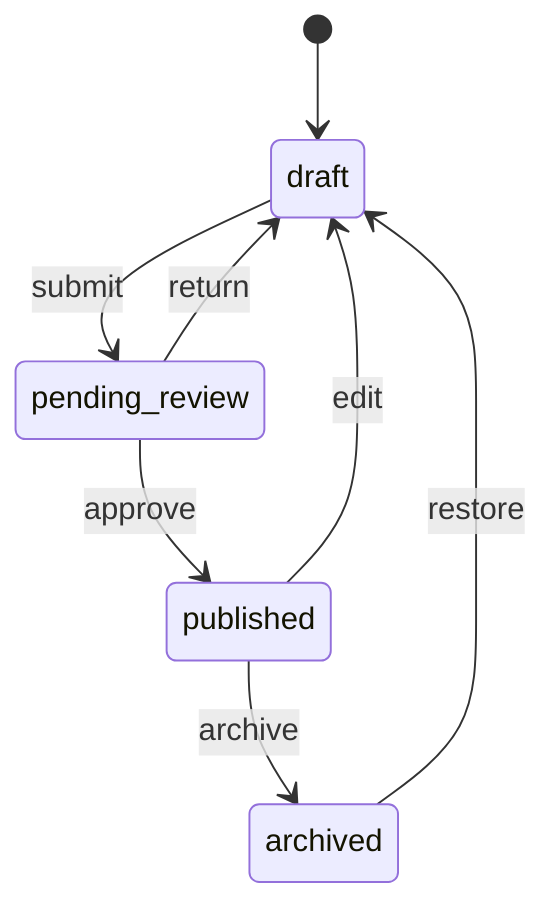

# Editorial workflow

Content types and entries are managed through tenant-scoped routes and
services. The observed workflow states are `draft`, `pending_review`,
`published`, and `archived`. Supported transitions include submission for
review, approval to published, return to draft, archive, and restoration; a
direct draft-to-published path is guarded by the bypass-review permission.

The route and service layers apply authentication, tenant context, explicit
permissions, audit behavior, webhooks, comments/collaboration support, and
plugin hooks around relevant operations. Published content is the input to
public delivery; public organization selection remains an unresolved policy
boundary.

This is an observed implementation summary. The owner-approved long-term
content, accessibility, session, and workflow policy is not inferred from the
current code and remains an explicit migration caveat.

Related controls are documented in [tenant isolation](/security/tenant-isolation.md), [authorization and RBAC](/security/authorization-and-rbac.md), and [extensibility and built-in plugins](/domain/extensibility-and-built-in-plugins.md).

## Preserved visualization

### content-lifecycle

