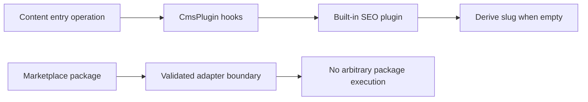

# Plugin boundary

The backend defines a `CmsPlugin` trait with entry-save and publish hooks. The
built-in registry includes an in-process SEO plugin that can derive a slug from
an entry title when the slug is empty. Plugin registry routes synchronize the
built-in set and allow authorized enable/disable operations.

Built-in plugins execute within the trusted Rust process. Marketplace packages
are handled through validated adapters and a constrained runtime authorization
surface; the current adapter does not execute arbitrary package code. This
distinction is an implementation boundary, not a claim that all future
extension policy is settled.

Plugin ownership, Marketplace roadmap boundaries, and the long-term policy for
third-party execution remain open migration decisions. Content integration is
described in [content and editorial workflow](content-and-editorial-workflow.md), and the wider Marketplace surface in [Marketplace](marketplace.md).

## Preserved visualization

### plugin-data-ownership

