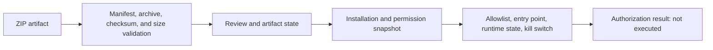

# Artifact and permission gates

Marketplace package input is constrained to ZIP artifacts with bounded size,
safe object-key construction, checksum verification, manifest validation, and
static archive inspection. The validation path can report executable or shell
artifacts, sensitive permissions, write permissions, and external-network
permissions. Stored artifact metadata tracks state such as quarantined,
reviewed, rejected, or legacy-unverified; a reviewed state requires a recorded
verification timestamp in the schema.

Installation and update paths validate supported product type, lifecycle
transition, artifact identity, version ordering, and permission snapshots. A
permission change requires reapproval, and runtime operations use an explicit
allowlist with an approved permission, allowed entry point, bounded JSON
payload, active installation, and ready runtime state. Organization and global
kill switches can block the runtime boundary.

The runtime authorization result is explicitly marked `not_executed`. The
current implementation therefore supports host-owned validation and adapter
authorization, not arbitrary Marketplace package execution or an implicit
server-side sandbox guarantee. Built-in plugins remain a separate trusted
in-process extension surface described in [extensibility and built-in plugins](/domain/extensibility-and-built-in-plugins.md).

Marketplace catalog, review, installation, finance, and analytics mechanisms
remain in [Marketplace](/domain/marketplace.md), while route-family access
controls are in [Marketplace and extension contracts](/api/marketplace-and-extension-contracts.md). File namespaces and quarantine controls are in [storage and file security](/security/storage-and-file-security.md).

## Open decision dependencies

* NOC-10: final Marketplace scope, settlement, disputes, external execution,
  cleanup, and operational safety policy require owner evidence.
* NOC-17: archive retention and regeneration policy are not established by
  artifact-state columns or cleanup code.

## Constructed visualization

### marketplace-runtime-safety-gate

