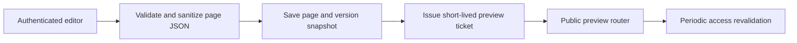
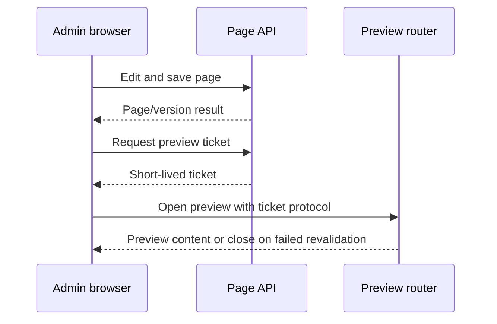

# Page lifecycle and preview

Protected page routes provide page CRUD, status handling, component registry
access, version snapshots, validation, and sanitization of page JSON. The
builder is part of the administrative route surface and uses the tenant and
authorization boundaries established by the backend.

Preview is issued from the protected page flow and consumed through a separate
public preview router. The ticket is short-lived and single-use; origin,
protocol, audience, user, organization, and page access are checked before
content is returned. Active preview sessions are periodically revalidated.

The component registry and JSON validation are repository observations. This
Concept does not define a durable component compatibility policy or promise a
production preview topology. The security control is detailed in [preview security](/security/preview-security.md).

## Preserved visualizations

### page-builder-workflow

### page-builder-flow

