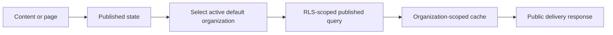

# Current delivery boundary

The public delivery domain serves published content entries, published pages,
public settings, public navigation, sitemap XML, and robots text. The
repository selects an active organization with slug `default`; every delivery
fetch uses that organization identifier, an RLS-scoped connection, and
explicit organization predicates. Content and pages require published state,
while settings and navigation require public flags. Rich entry data is
sanitized against the current field schema, and page responses resolve system
or organization component schemas.

Redis keys include the organization identifier and the delivery surface. The
current handlers normalize locale, sorting, filtering, and pagination, bound
list size, and invalidate organization-scoped content/page/sitemap/robots keys
after related writes. The cache boundary does not define a global freshness,
atomic publication, retry, or external CDN guarantee.

The API routes and webhook relationship are described in [public delivery and webhooks contract](/api/public-delivery-and-webhooks-contract.md). Tenant and database enforcement are described in [tenant data policy](/database/tenant-data-policy.md), while media delivery has separate controls in [storage and file security](/security/storage-and-file-security.md).

## Open decision dependencies

* NOC-01 and NOC-11: custom-domain, host, and domain-verification tenant
  selection are not implemented by the current default-organization lookup.
* NOC-09: delivery cache invalidation exists, but retry, compensation,
  idempotency, and user-visible failure policy are not established.

## Constructed visualization

### published-delivery-workflow

