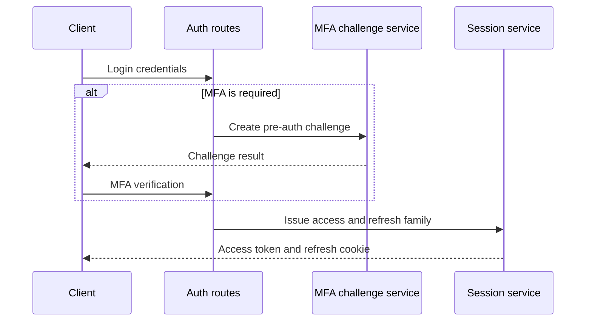
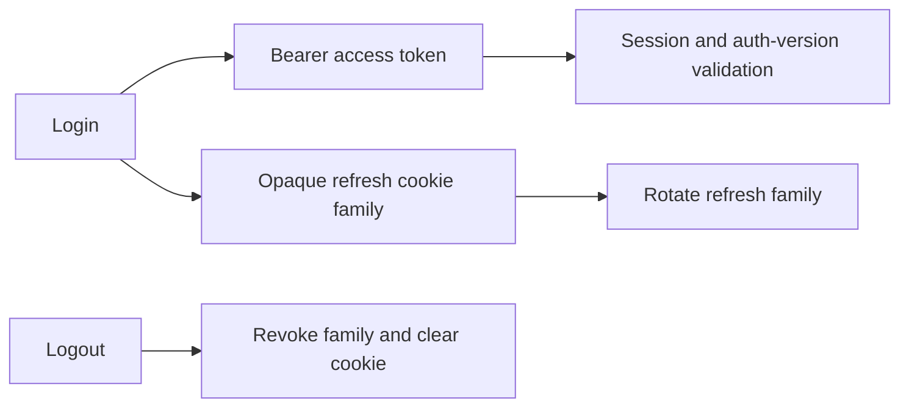

# Authentication flow

Protected requests require a bearer access token. The authentication middleware
verifies the token, validates the current session and authentication version,
checks a required step-up scope when a route requests it, and inserts claims
for downstream handlers.

Refresh uses an opaque cookie and a rotating refresh-token family. The session
service supports current-session listing, individual revocation, logout-all,
and access-claim validation. The route layer clears the cookie after logout.

MFA enrollment, TOTP verification, recovery-code use, disablement, and session
revocation are implemented. Redis-backed pre-auth and step-up challenges use
hashed records, single-use locks, TTLs, and rate limits. The repository
configuration supplies key-ring and challenge settings; it does not prove a
particular production secret-management deployment.

The access/session contract is summarized in [authentication and session contract](/api/authentication-and-session-contract.md). Authorization and organization context are separate controls described in [authorization and RBAC](/security/authorization-and-rbac.md) and [tenant isolation](/security/tenant-isolation.md).

## Preserved visualizations

### authentication-flow

### session-token-lifecycle

