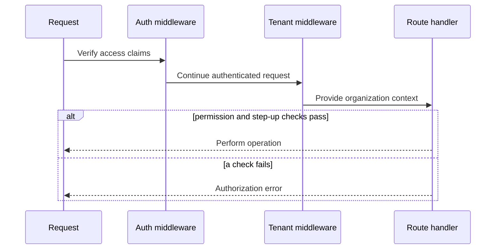
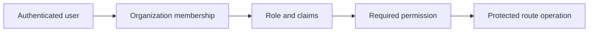

# Observed authorization decisions

Route handlers and middleware combine authenticated claims, organization
membership, role/permission checks, and selected step-up requirements. The
tenant middleware resolves the active organization from the request header and
membership before inserting a tenant context for downstream handlers.

Content and related feature routes apply explicit permission checks around
tenant-scoped operations. Administrative plugin and Marketplace operations
also use role or permission gates in their route/service layers. The precise
owner of module, operations, security, and documentation policy remains an
open decision; this Concept records the checks visible in source rather than
assigning ownership or asserting a complete policy catalog.

Authentication and session prerequisites are described in [authentication and sessions](authentication-and-sessions.md), while row-level tenant enforcement is described in [tenant isolation](tenant-isolation.md).

## Preserved visualizations

### authorization-decision-flow

### rbac-model

