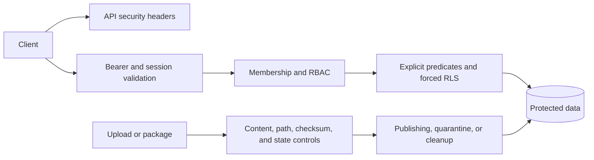

# Implemented controls

The request path verifies bearer access tokens and then validates their session
claims against persisted session state. Claims carry session, role, assurance,
authentication-method, authentication-time, and expiration data. Sensitive
operations are selected by method and path and require an MFA-authenticated
session plus a scope-bound, consumable Step-Up grant.

Global and organization RBAC helpers distinguish application roles from
organization roles. Tenant middleware adds active membership and organization
context checks. PostgreSQL RLS, explicit organization predicates, and
organization-scoped cache or cleanup keys provide additional data boundaries;
the detailed database inventory is in [tenant data policy](/database/tenant-data-policy.md).

The API security middleware applies a restrictive Content Security Policy,
`nosniff`, referrer, frame, cross-origin, and permissions headers. Security
audit helpers record security-sensitive events and reject secret-shaped audit
metadata. Token and audit cleanup uses configured retention values with input
validation. File and Marketplace artifact controls are described separately in
[storage and file security](/security/storage-and-file-security.md) and [Marketplace runtime and safety boundary](/domain/marketplace-runtime-and-safety-boundary.md).

# Evidence limits and risks

The repository demonstrates source-level mechanisms and test assertions. It
does not establish production ingress, TLS termination, secret-manager
configuration, external malware or monitoring services, alert ownership,
on-call response, backup/restore behavior, or live deployment parity. It also
does not provide a complete security risk acceptance, privacy, retention,
residency, or incident-response policy. A control in source is therefore
recorded as implemented evidence, not as an absolute security guarantee.

Legacy negative statements that conflict with current authentication, MFA,
Step-Up, or file-hardening source evidence are not promoted. Remaining
unverified risk statements are routed to owner or operational targets rather
than restated as current facts.

## Open decision dependencies

* NOC-04: production monitoring, SLOs, alerting, dashboards, and on-call
  ownership are not present as repository facts.
* NOC-05: security-event retention, privacy, deletion, legal hold, and
  residency policy require owner or legal evidence.
* NOC-15: accountable ownership for security, operations, and module support is
  not assigned by the source tree.

## Constructed visualization

### layered-security-boundaries

