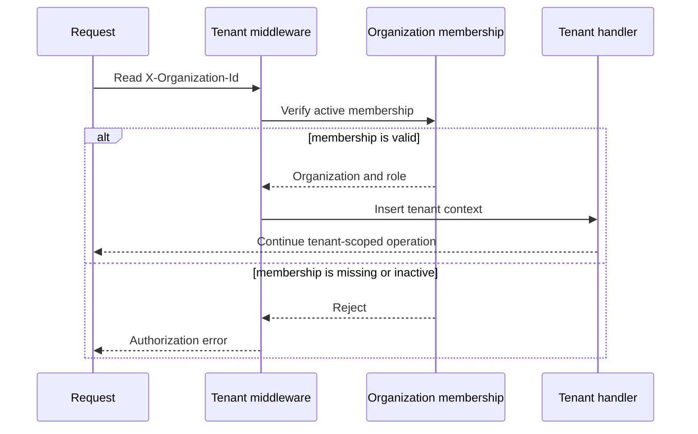
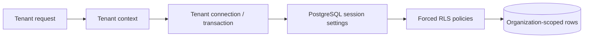

# Tenant request context

Tenant-protected requests require an organization UUID in
`X-Organization-Id`. Middleware verifies active membership, resolves the
organization context and role, applies configured rate and quota checks, and
inserts the tenant context for downstream handlers. Selected operations may
also require a step-up scope.

The RLS service sets organization and user context on tenant connections and
transactions. The migration defines helper functions, forces row-level
security on protected tables, and adds policies; application queries also use
explicit organization predicates in the observed routes and services. The
repository includes a security test matrix for cross-tenant access and insert
behavior.

These files establish implementation and test evidence, not proof that a
particular production database has applied every migration or that the live
deployment is configured identically. Public organization routing and the
durable ownership of this policy remain open decisions.

Authorization prerequisites are in [authorization and RBAC](/security/authorization-and-rbac.md), and the request-layer placement is in [runtime and request boundaries](/architecture/runtime-and-request-boundaries.md).

## Preserved visualization

### tenant-membership-workflow

### tenant-access-control

