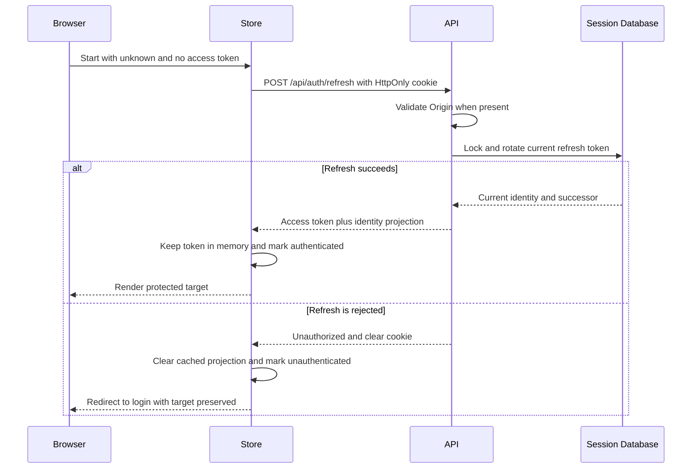
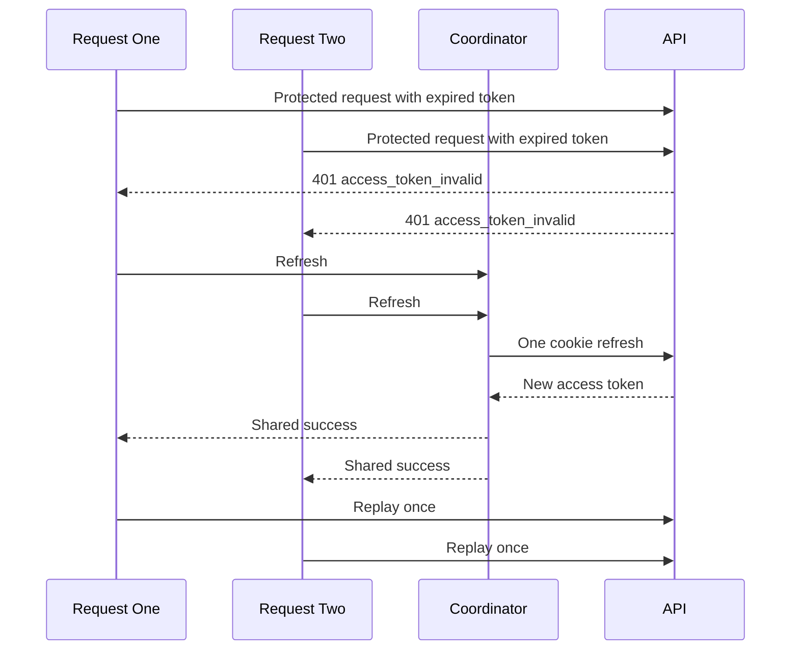
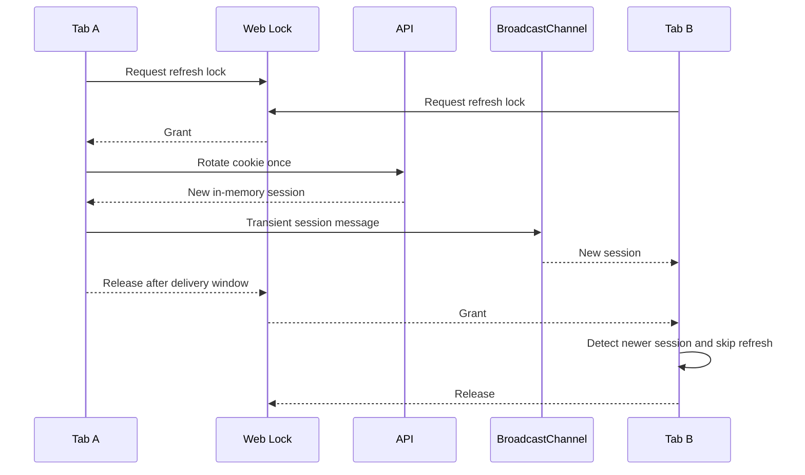
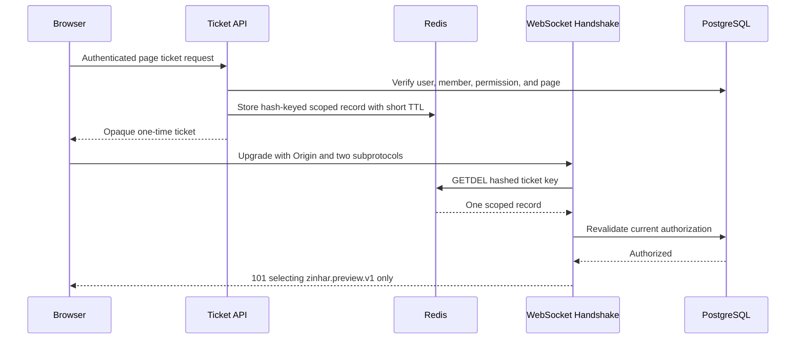
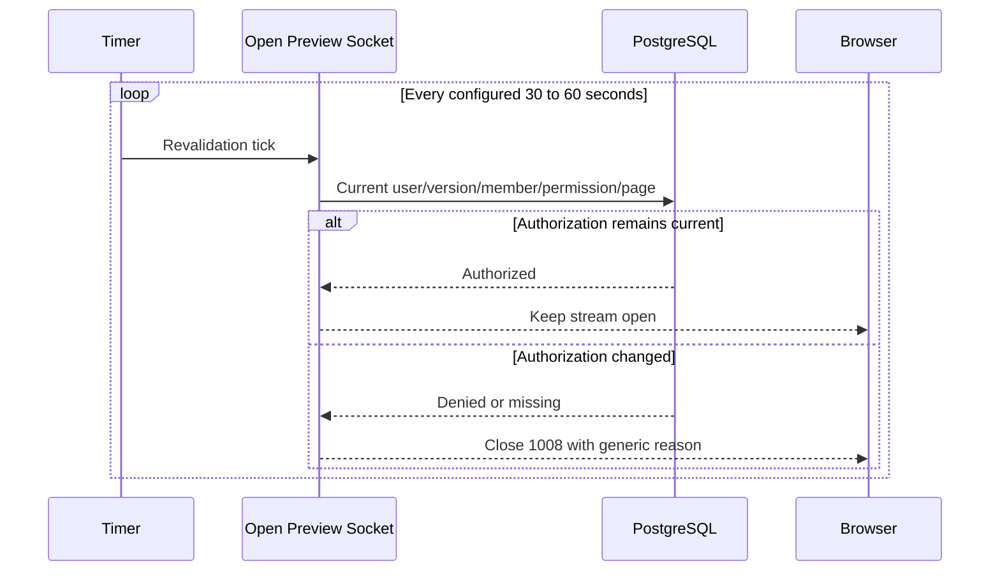

# Phase 3 Browser Authentication and Preview WebSocket Hardening

## Scope

Phase 3 removes persistent browser bearer credentials, restores sessions from
the Phase 2 HttpOnly refresh cookie, coordinates refresh across requests and
tabs, replaces preview WebSocket query credentials with one-time Redis tickets,
adds WebSocket Origin enforcement, and keeps open preview authorization fresh.

The phase is limited to repository source, tests, configuration templates,
documentation, local/disposable integration evidence, and browser verification.
It does not change Git history, create a commit, stage files, push, deploy,
inspect production systems, rotate real credentials, or modify real data.

## Starting Repository State

- Branch: `security/security-audit-fixes`.
- Starting commit:
  `ff148ff9 fix(security): complete phase 2 session and RLS hardening`.
- The working tree and index were clean at the start.
- Phase 1 was committed at `eaf90c43`; Phase 2 was committed at `ff148ff9`.
- Phase 2 authentication-version, refresh-family, SSRF, RLS, and
  non-superuser database protections were treated as invariants.
- No Phase 3 database migration was required because preview tickets are
  ephemeral Redis state.

## Inherited Findings

| ID | Severity | Confidence | Affected files | Evidence and realistic impact | Remediation status | Regression evidence |
| --- | --- | --- | --- | --- | --- | --- |
| `SEC-P01-003` | High | Confirmed | `frontend/src/services/api.ts`, `frontend/src/stores/useAppStore.ts` | Access tokens and legacy refresh state were persisted in browser-readable storage, allowing same-origin script execution to retain/exfiltrate credentials beyond the live document. | Closed for persistence. Both legacy keys are deleted and ignored; access tokens remain in volatile memory. Live-memory XSS exposure remains residual. | `api.test.ts`, `authSession.test.ts`, full frontend suite, and reload/logout browser verification. |
| `SEC-P01-009` | Medium | Confirmed | `backend/src/middleware/auth.rs`, `backend/src/middleware/tenant.rs`, `backend/src/routes/pages.rs`, `frontend/src/pages/PagesPage.tsx` | Preview bearer and organization context entered query strings, exposing them to URL logging, telemetry, screenshots, history, and clipboard paths. | Closed. Middleware query compatibility is removed and the handshake rejects every query string. | `previewSocket.test.ts`, preview-ticket protocol tests, repository query-credential scan, and live browser connection. |
| `SEC-P01-006` | Medium | Confirmed | `backend/src/routes/auth.rs`, `backend/src/config.rs`, `docker-compose.prod.yml` | Incorrect deployed cookie posture can expose a refresh bearer credential over an unsafe transport. | Preserved. Cookie attributes remain narrow and tracked production Compose defaults Secure; non-Compose deployment verification remains an operator action. | Auth cookie tests, Compose validation, and local browser cookie bootstrap/logout. |
| `SEC-P01-007` | Medium | Confirmed | `backend/src/middleware/auth.rs`, `backend/src/middleware/tenant.rs`, `backend/src/services/sessions.rs`, `backend/src/routes/pages.rs` | Stale user activity, global role, or authentication version could otherwise retain access until token expiry. | Phase 2 closure preserved and extended to preview handshake/revalidation. | Phase 2 session tests, full backend suite, and preview fail-closed revalidation test. |
| `SEC-P01-008` | Medium | Confirmed | `backend/src/services/sessions.rs`, `backend/src/routes/auth.rs`, `frontend/src/services/authSession.ts` | Reused or concurrently rotated refresh credentials can indicate theft and revoke a session family; uncoordinated legitimate tabs could cause the same availability response. | Phase 2 family rotation/reuse remains transactional; Phase 3 coordinates browser tabs without a grace period. | Phase 2 live session-family tests, `authSession.test.ts`, and authenticated browser bootstrap/reload. |

## Browser Authentication Threat Model

The browser is trusted to execute the shipped frontend but is not a safe
long-term secret store. A same-origin script compromise can read JavaScript
memory; removing persistence limits exposure after navigation/restart and
prevents passive extraction from browser storage. The HttpOnly refresh cookie
is not script-readable, but cookie-authenticated endpoints require an Origin
boundary against cross-site requests.

Multiple tabs may concurrently discover an expired token. Uncoordinated use of
the same rotating refresh cookie can make a legitimate second request look like
reuse and trigger the Phase 2 family-compromise response. Coordination must
therefore be single-flight within a tab and mutually exclusive across tabs.

BroadcastChannel messages, storage events, URLs, logs, exceptions, and UI text
are treated as possible disclosure paths. Only the transient cross-tab session
message may carry a new access token, because waiting tabs otherwise cannot use
the one successful cookie rotation. It is never persisted.

## Previous Browser Token Flow

Before Phase 3, `api.ts` initialized an access token from
`zinhar.access_token` in `localStorage` and wrote every replacement back.
`useAppStore.ts` independently initialized its token from the same key.
`RequireAuth` decided immediately from that persisted value, so reload behavior
depended on browser storage rather than the HttpOnly refresh session.

There was no automatic session bootstrap, no request replay contract, no
single-flight refresh, no tab coordination, and no cross-tab logout. A generic
request failure could not distinguish an expired access token from an
authorization denial.

## New In-Memory Access-Token Model

`api.ts` starts with a null access token, deletes both legacy access/refresh
storage keys, and updates only module memory. `useAppStore` also starts with a
null token. User and organization projections may be cached because they are
not bearer credentials, but failed bootstrap or logout clears them before
protected UI is shown.

Bearer and organization headers are attached only when the resolved request
origin equals the configured API origin. An absolute untrusted URL receives no
Authorization header and uses `credentials: omit`.

The backend now emits the stable error code `access_token_invalid` for a
present-but-invalid, expired, stale-version, inactive-user, or obsolete-role
access token. Missing authentication remains generic `unauthorized`; membership
and permission failures remain `forbidden`.

## Session Bootstrap Flow

The frontend session state is one of `unknown`, `refreshing`,
`authenticated`, or `unauthenticated`. `SessionBootstrap` starts one coordinated
refresh. Protected routes show a neutral restoring state while bootstrap is
unknown/refreshing; they never flash protected content and do not redirect
until the result is definitive. An unauthenticated redirect records the full
path/search/hash and login returns to that target.

## Single-Tab Refresh Coordination

All refresh callers share one module-level promise. Protected requests retry
only when all of these conditions hold:

- the request required authentication;
- it targeted the trusted API origin;
- the response status is `401`;
- the machine code is exactly `access_token_invalid`;
- the request is not the refresh endpoint;
- the request has not already been replayed.

Every `403`, generic `401`, refresh failure, and second failure is returned
without another refresh.

## Cross-Tab Refresh Coordination

Web Locks provide the primary origin-wide refresh critical section. The lock
holder checks whether a waiting tab already received a newer session, rotates
only if needed, broadcasts the transient response, and briefly holds the lock
so waiters process the message before entering.

When Web Locks are absent, a short BroadcastChannel election selects one
contending tab; losers wait for its session, logout, failure, or a bounded
timeout. A winner failure rejects queued tabs rather than allowing each to
rotate independently. If neither primitive exists, refresh fails closed.
Storage events are ignored and never establish authentication.

Logout calls the cookie endpoint even if the access token is expired, clears
local memory in a `finally` path, and broadcasts logout so all tabs stop using
the session and preview reconnect loops.

## Cookie and CSRF Boundaries

The Phase 2 refresh cookie remains `HttpOnly`, `SameSite=Lax`, scoped to
`Path=/api/auth`, has deterministic `Max-Age`, omits Domain, and adds Secure
when `COOKIE_SECURE=true`. The tracked production Compose default is true.
Logout emits the same attributes with an empty value and `Max-Age=0`.

Refresh and logout validate browser Origin before reading or mutating session
state. The only accepted browser value is the exact canonical
`CORS_ORIGIN`. `null`, invalid UTF-8, malformed origins, credentials, path,
query, fragment, duplicates, and any other origin are rejected. Missing Origin
is accepted for non-browser API clients.

Credentialed CORS allows one explicit configured origin and never wildcard
credentials. Authorization, Content-Type, and X-Organization-Id are the only
allowed request headers.

## Previous Preview WebSocket Authentication

The frontend copied a WebSocket URL containing the access token and active
organization ID as query parameters. Auth and tenant middleware accepted
`access_token`, `token`, and `organization_id` on preview paths. Those values
could enter clipboard history, reverse-proxy access logs, browser/telemetry URL
capture, support screenshots, or exception reports. A leaked bearer token was
not page-scoped or single-use.

The handshake did not validate Origin, and open connections subscribed to
process-local updates without rechecking user activity, authentication version,
membership, permission, or page access.

## WebSocket Ticket Design

An authenticated tenant request to
`POST /api/pages/{id}/preview-ticket` must pass current bearer verification,
current active membership, organization request limits/quota, preview-reader
RBAC, and page access.

The backend generates 32 random bytes from the operating-system CSPRNG and
base64url-encodes them without padding. The record is bound to:

- audience `preview-websocket`;
- user ID;
- organization ID;
- page ID;
- authentication version;
- issued-at timestamp;
- expiry timestamp.

The default TTL is 30 seconds and configuration is rejected above 60 seconds.
Issuance has a separate Redis-backed per-user, per-minute limit. Redis
connection/script/storage failure denies issuance with a generic service error.

## Ticket Storage and Atomic Consumption

The raw ticket exists only in the issuance response, frontend memory, and the
credential subprotocol offered by the client. Redis keys use a SHA-256-derived
base64url digest; raw ticket material is never stored. The value is scoped JSON
with a Redis expiry matching the configured TTL.

Consumption uses Redis `GETDEL`. Concurrent handshakes for one ticket therefore
produce at most one record and one success. Missing, reused, expired, malformed,
wrong-audience, wrong-page, future-issued, or overlong-lifetime records are
rejected generically. Scope errors consume the ticket and cannot be corrected
and replayed.

## WebSocket Protocol Authentication

The client offers exactly:

- `zinhar.preview.v1`;
- `zinhar.ticket.<opaque-ticket>`.

The server requires exactly one stable application protocol, exactly one valid
ticket protocol, and no unsupported protocol. It configures Axum to offer only
`zinhar.preview.v1`, so the credential-bearing protocol is never selected or
echoed in the handshake response.

The WebSocket URL contains only `/api/preview/{page_id}`. Any query string,
including a legacy token or organization parameter, is rejected before ticket
consumption.

## Origin Validation

`PREVIEW_WS_ALLOWED_ORIGINS` is a non-empty comma-separated exact allowlist and
defaults to the configured frontend/CORS origin. Every entry and request value
must be a canonical HTTP/HTTPS origin with no credentials, path, query, or
fragment.

The browser handshake requires exactly one Origin. Missing, `null`, malformed,
duplicate, and untrusted origins are denied before Redis consumption. Local
development may explicitly allow its HTTP frontend origin; production should
list only deployed HTTPS frontend origins.

## Authorization Freshness

After protocol/origin checks and atomic ticket consumption, the handshake:

1. validates audience/page/time scope;
2. loads the current active user/global role/authentication version;
3. compares the ticket authentication version;
4. loads the current active organization and active membership;
5. checks preview-reader permission;
6. loads the page through the tenant/RLS connection.

The open socket repeats steps 2–6 at a configured interval constrained to
30–60 seconds. User deactivation/reactivation, authentication-version change,
membership removal/suspension, permission removal, organization deactivation,
page removal, or loss of page access closes the socket with policy code 1008
and a generic reason.

## Frontend Preview Lifecycle

The Page Builder now starts a real preview connection instead of copying a
credential-bearing URL. Every initial connection and reconnect first requests
a fresh ticket. The URL builder strips query/fragment state and maps HTTP to WS
or HTTPS to WSS.

The browser verifies that the selected protocol is exactly
`zinhar.preview.v1`. Protocol mismatch, invalid payload, policy rejection,
logout, and definitive ticket API statuses stop reconnecting. Transient
failures use exponential backoff capped at four consecutive attempts and four
seconds. No ticket value is logged, shown, persisted, placed on the clipboard,
or reused.

## Compatibility Impact

- Existing browser sessions restore from the valid Phase 2 refresh cookie;
  legacy persisted access/refresh values are deleted and ignored.
- Browsers need Web Locks or BroadcastChannel for safe automatic refresh.
  Modern browsers with BroadcastChannel but no Web Locks use the election
  fallback. Browsers with neither fail closed and require a fresh login/browser.
- API clients must inspect the stable error code before deciding to refresh.
- Logout no longer requires a bearer token; it acts on the HttpOnly cookie and
  enforces browser Origin.
- Legacy preview URLs, bearer headers, query tokens, query organization IDs,
  missing Origin, and unsupported protocol lists no longer work.
- Preview clients must call the ticket endpoint immediately before every
  connection/reconnect and offer both required subprotocols.
- Redis must support `GETDEL`; tracked development/production images use Redis
  7.
- Multi-replica preview message fan-out remains process-local. Ticket state and
  authorization are shared, but update broadcasting is not.

## Confirmed Phase 3 Findings

| ID | Severity | Confidence | Affected files | Evidence before change and realistic impact | Remediation status | Regression-test evidence |
| --- | --- | --- | --- | --- | --- | --- |
| `SEC-P03-001` | Medium | Confirmed | `frontend/src/services/api.ts`, `frontend/src/services/authSession.ts`, `frontend/src/stores/useAppStore.ts` | No tab-wide refresh critical section existed. Simultaneous legitimate cookie rotation could invoke Phase 2 reuse protection, revoke the family, and sign the user out across tabs. | Closed with in-tab promise single-flight, Web Locks, transient BroadcastChannel session/logout delivery, a bounded election fallback, and fail-closed behavior without safe primitives. | `authSession.test.ts` covers one refresh, shared failure, logout without storage, and ignored storage events; `api.test.ts` covers one stable-code retry. |
| `SEC-P03-002` | Medium | Confirmed | `backend/src/routes/pages.rs`, `backend/src/config.rs`, `frontend/src/services/previewSocket.ts` | The preview WebSocket route accepted browser credentials without validating Origin, enabling a malicious origin to attempt Cross-Site WebSocket Hijacking with ambient/obtained authority. | Closed with exactly one canonical non-null allowed Origin before ticket consumption, plus rejection of missing, duplicate, malformed, and untrusted values. | Backend exact-origin tests, cookie-Origin tests, protocol tests, and a successful trusted-origin local browser handshake. |
| `SEC-P03-003` | Medium | Confirmed | `backend/src/routes/pages.rs`, `backend/src/services/rbac.rs` | Preview authorization was checked only before upgrade, so account/version/membership/role/page changes could leave an established socket authorized indefinitely. | Closed with current database authorization at handshake and every configured 30–60 seconds; denial or authoritative-state failure closes with policy code and a generic reason. | `preview_revalidation_fails_closed_without_authoritative_state`, RBAC matrix tests, full backend suite, and live authorized WebSocket establishment. |

No new Critical or High source finding was confirmed in this phase.

## Earlier Findings Closed

- `SEC-P01-003`: closed for access/refresh token persistence. The browser now
  removes both legacy keys and stores the access token only in memory.
- `SEC-P01-009`: closed. Preview access tokens and organization context no
  longer enter URLs; backend query compatibility was removed.
- Phase 2 `SEC-P01-007` and `SEC-P01-008` closures remain enforced and now also
  protect preview handshake/revalidation and cross-tab refresh.

## Changes Applied

Created:

- `backend/src/services/preview_tickets.rs`;
- `backend/tests/docker-compose.phase3.yml`;
- `frontend/src/components/SessionBootstrap.tsx`;
- `frontend/src/components/RequireAuth.test.tsx`;
- `frontend/src/services/authSession.ts`;
- `frontend/src/services/authSession.test.ts`;
- `frontend/src/services/previewSocket.ts`;
- `frontend/src/services/previewSocket.test.ts`;
- this report.

Modified:

- backend configuration, error model, auth/tenant middleware, auth/pages
  routes, router/OpenAPI registration, service registry, and RBAC;
- frontend auth route guard, main bootstrap, auth/page UI, API client/store,
  API/session/preview tests, and API types;
- environment/production Compose templates;
- API, architecture, historical diagrams/examples, OKF authentication/preview
  inventories, security documentation, and persistent handoff documentation.

No migration was created. No file was staged or committed.

## Validation Results

Completed:

- `cargo fmt --manifest-path backend/Cargo.toml -- --check`: passed;
- `cargo clippy --manifest-path backend/Cargo.toml --all-targets --all-features
  -- -D warnings`: passed;
- `cargo test --manifest-path backend/Cargo.toml --all-features`: passed with
  159 library tests, 2 conditional integration-harness entries, and doc tests;
- focused access-claim error mapping test: passed, confirming authoritative
  invalid identity is refreshable while database/service errors remain 5xx;
- focused cookie-Origin test: passed;
- focused preview fail-closed revalidation test: passed;
- focused preview-ticket selection: 6 passed;
- live disposable Redis 7 selection: 6 passed, including hash-only storage,
  bounded TTL, one success under concurrent consumption, reuse rejection,
  forced expiry, issuance rate-limit denial, and unavailable-Redis fail-closed
  behavior;
- `npm --prefix frontend run lint`: passed;
- `npm --prefix frontend run typecheck`: passed;
- `npm --prefix frontend test`: 8 files and 32 tests passed;
- `npm --prefix frontend run build`: passed with the existing non-fatal
  large-chunk advisory;
- `docker compose config --quiet`: passed with the existing obsolete-version
  warning;
- production Compose interpolation/config validation with a temporary
  placeholder env file: passed; the file was deleted immediately afterward;
- `git diff --check`: passed;
- sensitive-key pattern scan: no private key, certificate, or
  production-shaped provider token matched;
- token/ticket transport and logging scan: no active credential-bearing preview
  URL or token/protocol logging path remained; historical Phase 1/2 evidence was
  intentionally retained;
- changed source/configuration/Markdown Persian-range scan: passed;
- Phase 3 exact-heading and Mermaid sequence count checks: passed;
- disposable Phase 3 PostgreSQL/Redis projects, networks, volumes, temporary
  processes, and the Compose-validation environment file were removed; no
  Phase 3-named Docker resource remained.

## Browser Verification

Local browser verification used isolated disposable PostgreSQL and Redis plus
the development backend/frontend:

- a protected `/pages` target rendered only the restoring state before redirect
  and did not flash protected content;
- registration/login returned to the preserved path, query, and route state;
- reload restored the authenticated session through the `HttpOnly` refresh
  cookie and kept the access token out of persistent browser storage;
- a disposable page opened an actual preview WebSocket, reached connected state,
  and produced no browser console warning/error;
- logout redirected to login, cleared the browser session, and stopped the
  preview lifecycle.

The first local host-alias combination used different `localhost`/`127.0.0.1`
sites, so the browser correctly withheld the SameSite cookie. The verification
was repeated with one canonical local origin and passed.

## Failed or Unavailable Checks

- The first frontend test invocation repeated the script's existing `--run`
  flag and stopped before testing. The corrected command produced the recorded
  result.
- The first sandboxed frontend run could not spawn esbuild (`EPERM`). The same
  test was rerun with the approved unsandboxed subprocess capability.
- An initial large route patch did not match repeated source context and applied
  nothing. It was split into exact patches.
- The first Rust compile caught a moved `String` in an async pattern guard. The
  work moved into the match arm and subsequent checks passed.
- Docker API access was unavailable inside the filesystem sandbox; the isolated
  Compose lifecycle was rerun through the approved Docker boundary.
- No real two-tab browser race or live database mutation during an already-open
  socket was executed because the repository has no installed multi-page
  browser automation harness. Deterministic coordinator tests, the fail-closed
  revalidation test, live cookie bootstrap/reload, and a real WebSocket
  connection provide the available evidence.
- No pinned Rust dependency advisory scanner is installed. Dependency advisory
  enforcement remains deferred; this does not affect the executed compiler,
  lint, test, Compose, browser, or leakage checks.

## Residual Risks

- Same-origin script execution can read the currently active in-memory access
  token and transient BroadcastChannel session message. CSP, dependency
  integrity, sanitizer coverage, and XSS prevention remain required.
- The HttpOnly refresh cookie remains a bearer credential. Exact Origin,
  SameSite, Secure production configuration, CORS, and HTTPS must all remain
  correct.
- Access and refresh token signing-key rotation, refresh-row retention cleanup,
  logout-all/session inventory, recovery, MFA, and step-up authentication are
  not implemented.
- Redis availability is required for preview tickets; failure intentionally
  disables preview connection/issuance.
- Preview update channels remain process-local and can diverge across replicas.
- A valid open socket may retain access for at most the configured revalidation
  interval after a change.
- Browser coordination depends on Web Locks or BroadcastChannel behavior and
  merits telemetry for timeouts/failures.

## Deferred Areas

- owner response for `SEC-P01-001` and any real credential/account/log review;
- complete CSP/XSS/rich-text browser mutation corpus;
- OpenAPI security schemes and exhaustive endpoint annotations;
- refresh-session inventory, logout-all, retention cleanup, MFA/recovery, and
  signing-key rotation;
- shared cross-replica preview update fan-out;
- exhaustive dynamic route-by-role/IDOR/browser compatibility matrix;
- production ingress/TLS/HSTS, firewall/egress, secrets, Redis ACL/TLS,
  backups, logs/redaction, monitoring, and container-runtime hardening;
- pinned dependency advisory enforcement in CI.

## Recommended Next Phase

Phase 4 should harden browser content execution and operational deployment:
define/enforce CSP and Trusted Types where compatible, replace or strengthen the
custom rich-text sanitizer with a browser mutation corpus, complete OpenAPI
security contracts, add refresh-session inventory/logout-all/retention/key
rotation design, add shared preview fan-out, and verify production
TLS/HSTS/CORS/cookie/Redis/log-redaction/secret controls without exposing or
changing real secrets.
