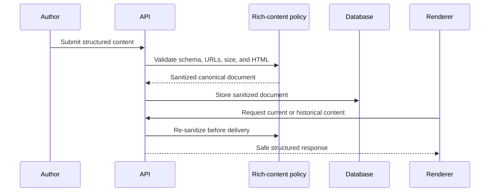
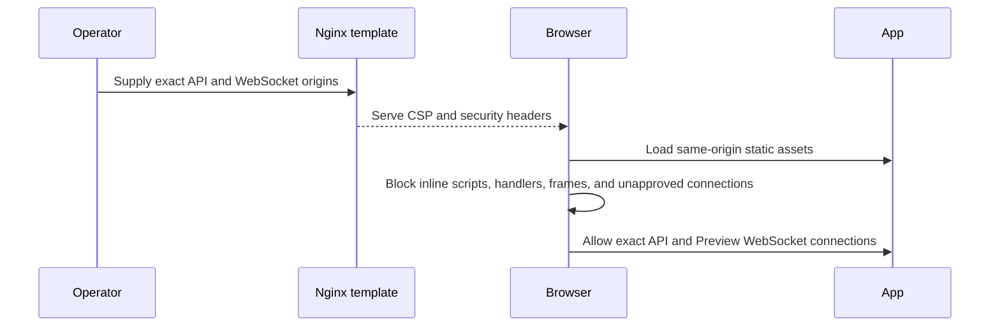
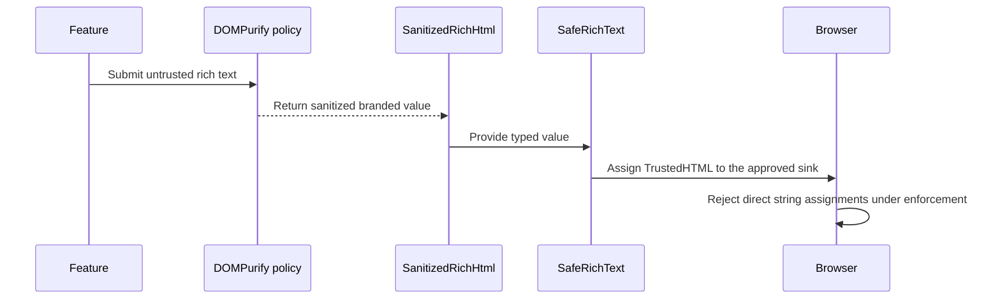
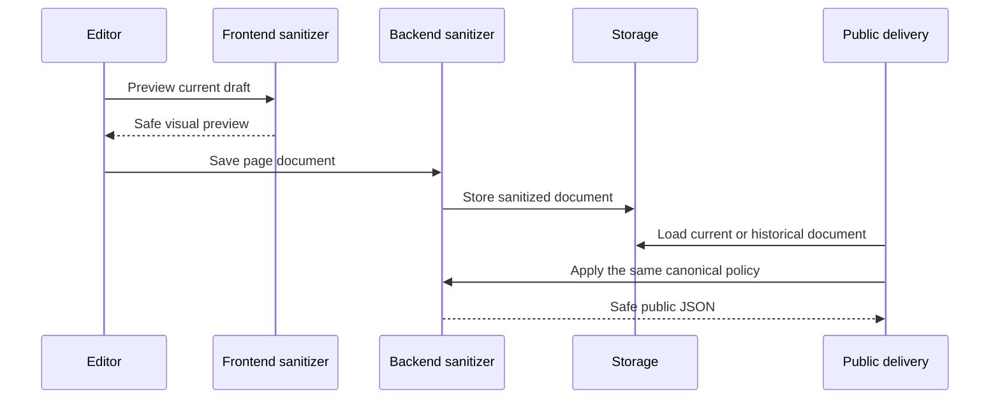

# Security Audit and Hardening Phase 4

## Scope

Phase 4 hardens browser content boundaries without redesigning authentication,
authorization, RLS, billing, Marketplace finance, webhooks, or email delivery. It
covers rich-text inputs, Page Builder documents, historical delivery responses,
interactive URLs, the single approved HTML sink, Content Security Policy (CSP),
Trusted Types, response headers, Preview WebSocket payloads, and browser XSS
regression evidence.

## Starting Repository State

- Branch: `security/security-audit-fixes`
- Starting commit: `b2e34c37`
- Phase 3 was committed at the starting commit.
- The initial Phase 4 inspection found an existing, uncommitted partial Phase 4
  implementation. The owner explicitly requested completion, so that work was
  preserved and completed rather than reset, stashed, cleaned, or discarded.
- No Phase 4 commit or push was created.

## Inherited Findings

`SEC-P01-021` was the exact inherited finding: the custom rich-text sanitizer had
focused tests, but broad browser parser differentials, mutation-XSS cases, and CSP
validation were unverified. Phase 2 explicitly deferred rich-text sanitizer and
browser mutation testing. Phase 3 explicitly deferred the CSP, Trusted Types, and
rich-text browser corpus while retaining live-memory token exposure as a reason
that XSS prevention remained necessary.

## Rich-Content Trust Model

| Classification | Suppliers | Storage and exposure | Required boundary |
| --- | --- | --- | --- |
| Plain text | Users, organization members, administrators, Marketplace creators | Relational text/JSON; admin React views; API responses | Schema and length validation, then React text escaping |
| Structured application data | API clients, Page Builder, Marketplace packages | JSONB, cache, WebSocket, webhooks | Schema validation, depth/size bounds, property-specific policies |
| Trusted application HTML | Frontend build only | Static application shell | Developer review and CSP; never mixed with user strings |
| Untrusted rich text | Content authors, page authors, imported/historical records | `content_entries.data`, `pages.page_json`, versions, cache, preview, delivery API | Parser-based server sanitization plus DOMPurify immediately before the approved sink |
| Untrusted Markdown | Not supported by the current runtime | No Markdown renderer or storage contract | Raw HTML remains unavailable; a future renderer must disable raw HTML and sanitize output |
| Untrusted URLs | Authors, Marketplace creators, providers, API responses | Rich text, component props, navigation, screenshots, checkout links | Central scheme/origin/canonicalization policy before attributes or navigation |
| Untrusted media | Organization uploaders and remote Marketplace metadata | Upload storage, URLs, image elements | Content-derived MIME allowlist; no SVG; same-origin rich-text images; HTTPS remote catalog images |
| Administrative configuration | Administrators and operators | Database and environment | Never treated as code-capable HTML; typed validation and exact origins |
| Developer templates | Repository maintainers | React source and Nginx template | Review, build integrity, CSP, and deterministic sink scan |

The governing rule is: untrusted content must never reach an HTML-capable browser
sink unless it has passed through the approved sanitizer policy or has been
encoded as plain text. Administrative authors are not trusted as code authors.

## Content Source and Sink Inventory

| Source | Transform/storage | Browser or downstream sink | Phase 4 result |
| --- | --- | --- | --- |
| Content-type `richtext` fields | Entry validation; `content_entries.data`; Redis delivery cache | Admin structured views and public delivery JSON | Sanitized on write and every read/delivery, including historical rows |
| Page Builder flat `richtext`/`url` props | Page validation; `pages.page_json`; `page_versions`; template imports | Admin editor/preview, Preview WebSocket, public delivery JSON | Sanitized on write and render; flat and legacy JSON Schema normalized |
| Legacy `rich-text.properties.html` | Historical Page Builder schema and documents | Admin preview and public delivery JSON | Treated as rich text; rendered only by `SafeRichText` |
| Page node `styles` and metadata image | Page JSON and versions | Preview and delivery | Custom style objects are cleared; OG image is same-origin only |
| Marketplace description/review/report text | Marketplace tables and APIs | React text nodes | Remains plain text; no HTML sink |
| Marketplace support, screenshot, checkout, and billing URLs | Database/provider responses | Anchor, image, or top-level navigation | Central URL validation; unsafe values are omitted or rejected |
| Media upload bytes, alt text, captions | Filesystem and media tables | Static file URL and React text | SVG is rejected by content-derived MIME validation; captions remain text |
| Comments, workflow messages, audit metadata, email status, webhook delivery data | Relational/JSON records | React tables or JSON payloads | Plain/structured rendering; no HTML-capable sink found |
| SEO metadata, settings, plugin descriptions, package metadata | JSON/text records | API or React text | No direct HTML sink; URL fields retain route-specific validation |
| Preview WebSocket page documents | Server-authorized page load and broadcast | Page Builder preview | Server sanitization, payload-shape validation, then the same preview renderer |
| Cached public entries/pages | Redis JSON | Headless delivery clients | Cache namespace bumped; sanitized before cache population |
| Export, PDF, print, Mermaid, Markdown, syntax highlighting | No runtime renderer found | None in the current product | No Phase 4 sink; future implementations require a new boundary review |

Repository-wide AST policy scanning found one intentional
`dangerouslySetInnerHTML` boundary and no runtime `innerHTML`, `outerHTML`,
`insertAdjacentHTML`, `document.write`, `eval`, `Function`, or `srcDoc` sink.

## Existing Rendering Architecture

ZinharCMS is headless for public content: the repository publishes JSON delivery
APIs but does not include a public website renderer. The administrative React
application previously rendered ordinary fields as React text and did not have
an approved rich-HTML boundary. Page documents could still store rich HTML and
reach public delivery clients or preview messages without a consistent
historical render-time policy. Phase 4 adds the missing explicit boundary without
turning plain-text surfaces into HTML.

## Canonical Rich-Text Policy

Allowed elements are:

`a`, `b`, `blockquote`, `br`, `code`, `del`, `em`, `h1`-`h6`, `hr`, `i`,
`img`, `li`, `ol`, `p`, `pre`, `s`, `span`, `strong`, `table`, `tbody`, `td`,
`tfoot`, `th`, `thead`, `tr`, `u`, and `ul`.

Allowed attributes are element-specific:

- `a`: `href`, `target`, `title`, `aria-label`
- `img`: `src`, `alt`, `title`, `width`, `height`, `aria-label`
- `td`: `colspan`, `rowspan`
- `th`: `colspan`, `rowspan`, `scope`

IDs, names, classes, inline styles, CSS variables, `data-*`, arbitrary ARIA
attributes, comments, forms, controls, frames, scripts, templates, SVG, MathML,
media players, objects, embeds, canvas, and unknown elements are denied. All
attributes beginning with `on` are removed case-insensitively. Malformed HTML,
duplicate attributes, namespaces, and entity decoding are handled by HTML
parsers rather than security-sensitive regex rewriting. Code blocks,
blockquotes, headings, lists, and tables are preserved. Links opened in a new
context receive `rel="noopener noreferrer"`.

## Server-Side Sanitization

`ammonia 4.1.4` replaces the custom tag scanner. It uses an HTML5 parser and an
explicit allowlist. Entry rich text is sanitized before storage and again on
authenticated/public reads. Page documents are schema-validated, sanitized
before storage/restoration/import, and sanitized again for historical lists,
details, versions, transitions, Preview WebSocket loads, and public delivery.
Cache keys use a new policy namespace so an old unsanitized cache value is not
reused.

The canonical stored representation remains sanitized HTML because that is the
existing editable source format. Existing historical rows are not rewritten by a
migration; they are sanitized on every render/delivery path. This avoids an
irreversible bulk migration while closing the trust boundary.



## Frontend Rendering Boundary

`SafeRichText` is the only approved `dangerouslySetInnerHTML` component. It
accepts only the `SanitizedRichHtml` branded type produced by
`createSanitizedRichHtml`. DOMPurify uses the same tag, attribute, and URL
contract as the backend. Feature components cannot pass arbitrary strings,
change sanitizer options, disable sanitization, concatenate post-sanitization
markup, or create a second sink. A TypeScript negative test and an AST-based
source policy enforce the boundary.

## URL and Link Policy

Rich links allow `https`, `mailto`, `tel`, root-relative, dot-relative, and
single-fragment URLs. Rich-text images are root-relative only. External
navigation requires canonical HTTPS. Control characters, backslashes,
protocol-relative URLs, credentials, malformed URLs, encoded unsafe schemes,
`javascript`, `vbscript`, `data`, `file`, `filesystem`, `chrome`,
`chrome-extension`, `resource`, and `about` are rejected. URLs are limited to
2,048 bytes. External links use `noopener noreferrer`; Marketplace images also
use `no-referrer` and lazy loading. Direct checkout navigation now uses the same
validated wrapper.

## Media and Embedded Content Policy

Rich text cannot contain SVG, MathML, iframe, `srcdoc`, object, embed, audio,
video, source, track, canvas, or forms. The upload route derives MIME from bytes
and permits JPEG, PNG, WebP, PDF, and plain text; SVG is not accepted. Approved
embedded media would require a separate component, exact origin allowlist,
sandbox, referrer policy, and feature policy. No such HTML embed renderer is
enabled in Phase 4. Remote HTTPS Marketplace images remain allowed for product
compatibility and carry an explicit privacy tradeoff.

## Content Security Policy

Production frontend policy begins with `default-src 'none'`; blocks base,
objects, framing, inline handlers, and frames; allows only same-origin scripts
and styles; uses exact API and Preview WebSocket origins; permits same-origin/API
media and HTTPS catalog images; requires Trusted Types; and includes
`upgrade-insecure-requests`. Production has no `unsafe-eval`, script
`unsafe-inline`, wildcard script source, `data`, or `blob`.

Development keeps exact API, Preview WebSocket, and Vite HMR WebSocket origins.
Only development `style-src` includes `unsafe-inline` for Vite style injection.
Development does not enforce Trusted Types because it is a toolchain
compatibility surface; production preview and Nginx do enforce it.



## Security Response Headers

The backend owns API headers: a JSON-safe deny-all CSP, `nosniff`,
`X-Frame-Options: DENY`, `Cross-Origin-Opener-Policy: same-origin`,
`Cross-Origin-Resource-Policy: same-site`, a restrictive Permissions Policy, and
`Referrer-Policy: strict-origin-when-cross-origin`.

Nginx owns deployed frontend headers: the production CSP, HSTS, `nosniff`,
frame denial, COOP, same-origin CORP, Permissions Policy, and Referrer Policy.
Vite development and preview reproduce the relevant policy for local validation.
The Nginx entrypoint expands only the exact CSP origin variables.

## Trusted Types Design

The production CSP allows exactly `zinhar-rich-content` and DOMPurify's required
`dompurify` policy and enforces `require-trusted-types-for 'script'`. The
application policy accepts content only after DOMPurify sanitization with
`RETURN_TRUSTED_TYPE: false`, then returns the resulting `TrustedHTML`. Policy
creation is cached and idempotent. There is no permissive `default` policy. When
the browser lacks the API, the branded value still contains a DOMPurify-sanitized
string; unsupported browsers do not bypass sanitization.



## Editor and Rendering Parity

Flat component schemas and legacy JSON Schema `properties` are normalized in
both backend and frontend. In particular, legacy `rich-text.html` is treated as
rich text rather than a plain string. Editor preview uses the same frontend
policy as WebSocket updates, while writes and public delivery use the same
backend policy. The browser test showed that a malicious draft was displayed
safely, stored in stripped form, published, and returned through the public API
without executable markup.



## Preview WebSocket Content Boundary

Preview tickets, origin checks, one-time consumption, and authorization
freshness remain unchanged from Phase 3. The server now sanitizes the page
document before initial WebSocket delivery and before broadcasts. The frontend
validates the payload's page-document shape and closes the connection on an
invalid payload. Valid data is rendered by the same `PreviewNode` and
`SafeRichText` boundary as the editor.

```mermaid
sequenceDiagram
    participant Browser
    participant TicketAPI as Preview ticket API
    participant WebSocket
    participant BackendPolicy as Backend sanitizer
    participant Boundary as SafeRichText
    Browser->>TicketAPI: Request one-time scoped ticket
    Browser->>WebSocket: Connect with exact Origin and subprotocol ticket
    WebSocket->>BackendPolicy: Load and sanitize authorized page
    BackendPolicy-->>Browser: Send sanitized page document
    Browser->>Boundary: Validate shape and render rich properties
    Boundary-->>Browser: Safe preview; invalid payload closes the socket
```

## Malicious Content Corpus

`security/phase4-xss-corpus.json` contains 20 malicious and 5 safe cases shared
by backend and frontend tests. It covers scripts, handlers, encoded schemes,
mixed-case schemes, malformed markup, SVG, MathML, forms, iframes, objects,
embeds, base, meta refresh, style, DOM clobbering identifiers, and supported
formatting. Additional tests cover excessive nesting, tag/attribute count,
document size, URL size, legacy schema behavior, Trusted Types, and policy-name
alignment.

## Browser Security Verification

A disposable local PostgreSQL database and Redis database were used with the
production frontend build and enforced production-preview headers.

- Login, refresh-on-reload, navigation, and logout succeeded under CSP.
- A stored rich-text payload retained its harmless visible marker.
- Script, SVG, iframe, executable attributes, unsafe image sources, and unsafe
  link destinations were absent.
- A safe external link retained HTTPS and received `noopener noreferrer`.
- No execution marker was created.
- The page was saved, submitted, published, and returned by the public delivery
  API in sanitized form.
- Preview WebSocket connected under CSP; a second malicious payload was
  sanitized after save/broadcast and no execution marker was created.
- An inline-script probe remained blocked.
- A same-origin external probe attempted direct string assignment to
  `innerHTML`; enforcement produced `TypeError` and injected zero nodes.
- Application console error/warning collection was empty.
- The application URL contained no token, ticket, code, JWT, or secret query
  parameter.

The repository has no public HTML renderer. Public-browser execution is
therefore not an applicable in-repository sink; the public JSON response and its
stored value were validated for absence of executable content.

## Stored Content Compatibility

No migration rewrites historical content. New entry/page writes store sanitized
HTML. Historical entries, pages, page versions, template imports, transitions,
preview loads, and public deliveries are sanitized on read. The delivery cache
namespace change prevents reuse of previous policy output. Legacy JSON Schema
components are supported. Page `styles` objects are cleared because no safe CSS
grammar or isolated renderer exists; installations relying on arbitrary Page
Builder styles will lose those styles when written or returned.

## Performance and Size Limits

Rich-text input is limited to 128 KiB, URLs to 2,048 bytes, tags to 4,096,
attributes to 4,096, and nesting to 128. Page documents are limited to 1 MiB.
Complexity is checked before parser work. Sanitization occurs on write and on
render/delivery, adding bounded parser cost. Sanitized delivery responses remain
cacheable, and the policy version in cache keys avoids cross-policy reuse.

## Confirmed Phase 4 Findings

| ID | Severity / confidence | Source and boundary | Evidence and realistic impact | Status and regression evidence |
| --- | --- | --- | --- | --- |
| `SEC-P04-001` | High / Confirmed | Organization-authored content/Page rich text, historical/imported page JSON, and public/preview delivery paths in `backend/src/services/security.rs`, `routes/content.rs`, `routes/pages.rs`, and `routes/delivery.rs` | Page documents lacked one parser-based rich-content boundary and historical rows were trusted based on prior storage. Executable markup could survive into headless delivery JSON and become stored XSS in a consumer that rendered the declared rich-text field. The existing Zinhar admin rendered affected values as text, so no pre-fix admin execution was claimed. | Remediated with Ammonia, write/read sanitation, legacy-schema normalization, cache versioning, 7 focused backend tests, full backend tests, browser stored/published checks, and database/public-response assertions. |
| `SEC-P04-002` | Medium / Confirmed | Browser responses and DOM sink ownership in the old `frontend/nginx.conf`, Vite configuration, and frontend renderers | The frontend had no enforced CSP, no Trusted Types contract, and no single typed HTML boundary. This was missing defense in depth and an unsafe-rendering opportunity rather than a confirmed pre-fix XSS sink. | Remediated with strict production/development policies, Nginx/header ownership, `SafeRichText`, branded values, AST sink policy, CSP/Trusted Types unit tests, and real enforcement probes. |
| `SEC-P04-003` | Medium / Confirmed | Legacy Page Builder JSON Schema, Marketplace URLs, provider checkout URLs, and direct anchor/image/navigation sinks | Flat-only schema interpretation caused editor/preview/public policy drift, while browser URL consumers relied on feature-local handling. Compromised, historical, or malformed URL data could create unsafe navigation/privacy behavior; no successful script execution was demonstrated. | Remediated with schema normalization, centralized URL wrappers, canonical HTTPS validation, safe link attributes, legacy regression tests, and browser malicious-link checks. |

No Critical finding was confirmed. The three findings were remediated in the
working tree; they are not claims that all XSS classes are eliminated.

## Earlier Findings Closed

`SEC-P01-021` is closed: a maintained parser-based backend sanitizer, DOMPurify
frontend boundary, shared malicious corpus, CSP, Trusted Types, browser parser
execution tests, stored/published checks, and Preview WebSocket checks now
provide the evidence that was previously missing. Phase 2 and Phase 3 deferred
rich-text/CSP/browser-XSS work is likewise completed within the current
architecture.

## Changes Applied

- Added `ammonia 4.1.4` and `dompurify 3.4.12` with lockfile updates.
- Added centralized backend rich-content, URL, page-schema, and size policies.
- Applied the policy to entry, page, version, Marketplace template, preview, and
  public delivery paths.
- Added the branded frontend policy and one approved HTML renderer.
- Hardened Page Builder, Marketplace screenshots/support links, and billing or
  Marketplace checkout navigation.
- Added strict backend, Vite, production-preview, and Nginx header policies.
- Replaced the static Nginx config with an entrypoint-expanded template and
  required exact CSP origins in production Compose.
- Added the shared corpus, AST sink check, CSP tests, Trusted Types tests,
  Page Builder legacy-schema test, and backend parser tests.
- No database migration was added.

## Validation Results

Successful commands and checks:

- `cargo fmt --all -- --check`
- `cargo clippy --offline --all-targets --all-features -- -D warnings`
- `cargo test --offline` — 166 unit tests and 2 integration contract tests
  passed
- `npm --prefix frontend run lint`
- `npm --prefix frontend run typecheck`
- `npm --prefix frontend test` — 44 tests passed across 11 test files; the final
  focused rich-content/Page Builder rerun passed 8 tests
- `npm --prefix frontend run build`
- `npm --prefix frontend run security:sinks`
- `docker compose config --quiet`
- `docker compose -f docker-compose.prod.yml config --quiet` with non-secret
  placeholders
- `git diff --check`
- Changed/untracked English-language scan — no Persian-script text found
- Production-shaped token/private-key/live-provider-secret scan — no match
- Browser stored/admin/published/Preview WebSocket/CSP/Trusted Types/auth/logout
  matrix — passed as described above

The complete matrix above was rerun after the final sanitizer-policy changes.
The final documentation-only structure, whitespace, language, and
secret-pattern rerun passed before Phase 4 closure.

## Failed or Unavailable Checks

- Initial Cargo downloads failed because the local resolver could not resolve
  `static.crates.io`. The exact locked crates were downloaded from the official
  CDN with TLS hostname verification, every SHA-256 value was matched to
  `Cargo.lock`, and normal offline Cargo validation then succeeded.
- `cargo audit` is unavailable because the subcommand is not installed. No
  global tool was installed.
- `npm audit --omit=dev` was not run because the execution environment rejected
  transmission of dependency metadata to the public registry without separate
  authorization. The rejection was not bypassed.
- One focused Vitest command duplicated the package script's existing `--run`
  option and failed before test startup. The corrected command passed 8 tests.
- Sandboxed Vitest/build attempts encountered Windows `spawn EPERM` when
  esbuild started its helper process. Authorized out-of-sandbox reruns passed.
- A production Nginx container was not rebuilt or started. Template/header
  parity tests, production Compose interpolation, the Vite production build,
  and enforced production-preview browser probes passed.
- The next-day PostgreSQL/Redis cleanup recheck could not connect because
  Docker Desktop was no longer running. The disposable database drop and Redis
  database-15 flush completed during the original browser cleanup; the offline
  recheck still confirmed no Phase 4 temporary files and no listeners on ports
  8080 or 5173.
- Direct top-level browser navigation to the API JSON endpoint was blocked by
  the browser client. The same public endpoint was validated over local HTTP,
  and the browser application consumed the API normally.
- Initial red tests and lint/compiler failures were retained as development
  evidence and corrected; they are not counted as passing until their reruns.

## Compatibility Impact

Supported formatting becomes canonicalized, so exact HTML byte-for-byte
round-trips are not guaranteed. Unsupported elements and attributes disappear.
Existing arbitrary Page Builder styles are cleared. Legacy `rich-text.html`
documents now edit and preview correctly instead of being misclassified.
Marketplace unsafe URLs are omitted rather than rendered. Deployment now
requires exact CSP API and WebSocket origins. Development HMR keeps only the
style relaxation required by Vite.

## Operational Requirements

- Set `CSP_API_ORIGIN` and `CSP_WEBSOCKET_ORIGIN` to exact canonical production
  origins; they must not contain paths, credentials, queries, or fragments.
- Keep `VITE_API_URL`, CORS, Preview WebSocket allowed origins, and CSP origins
  aligned.
- Use the production Nginx entrypoint so its template is expanded.
- Terminate production traffic with HTTPS before relying on HSTS and
  `upgrade-insecure-requests`.
- Rebuild the frontend image when the CSP template or static asset set changes.
- Review whether remote Marketplace images are acceptable for privacy; if not,
  introduce a trusted media proxy or stricter origin list in a later phase.
- Run authorized npm and Rust advisory scans in a network-approved environment.

## Residual Risks

- A headless client can ignore the safe rendering contract and create its own
  unsafe sink; ZinharCMS now returns sanitized declared rich text, but downstream
  clients still require CSP and safe rendering.
- Remote HTTPS Marketplace images can disclose client IP and request timing.
- Parser and policy dependencies require ongoing advisory and policy-drift
  review.
- CSP reporting is not configured, so deployed violations are not centrally
  observable.
- Development intentionally permits inline styles and does not enforce Trusted
  Types.
- The repository still lacks a committed, continuously executed end-to-end
  browser test runner.

## Deferred Areas

- Authorized dependency-advisory scans and automation.
- CSP `report-to` or another privacy-reviewed reporting endpoint.
- Parser fuzzing and a larger browser-version mutation corpus.
- A separately isolated iframe/embed product feature, if future requirements
  justify one.
- A trusted media proxy or narrower remote-image origin catalog.
- CI integration for the AST sink policy and real browser security matrix.

## Recommended Next Phase

Phase 5 should automate dependency, supply-chain, and security regression gates:
run an authorized Rust and npm advisory audit, add the AST sink policy and shared
corpus to CI, add a maintained browser job that exercises production CSP and
Trusted Types, and define a privacy-reviewed CSP reporting strategy. The exact
next action is to inventory current CI and dependency-provenance controls from
starting commit `b2e34c37` plus the uncommitted Phase 4 working tree, without
committing or discarding Phase 4 changes.
