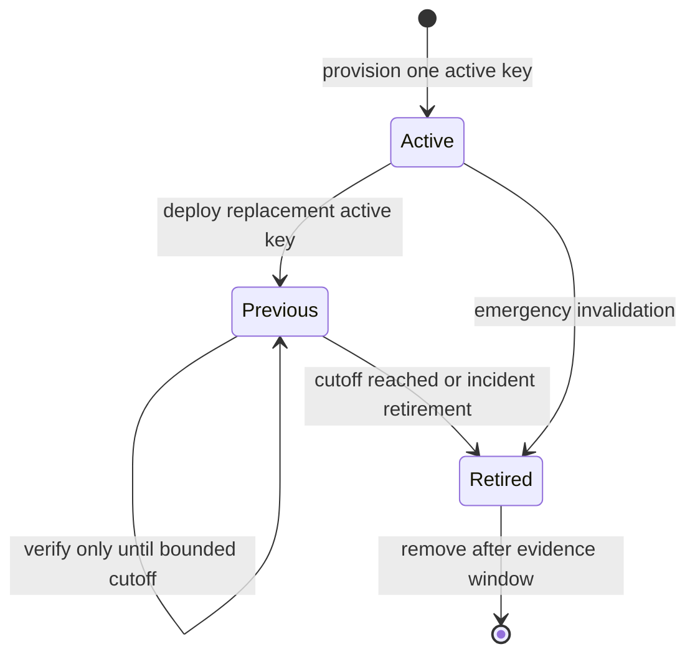
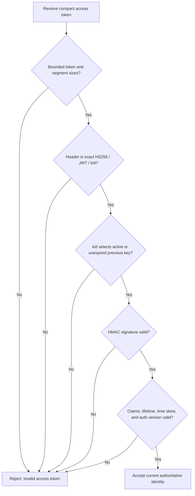
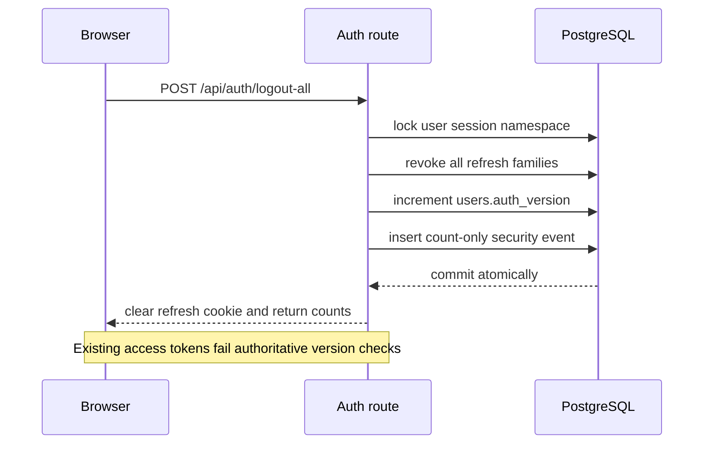
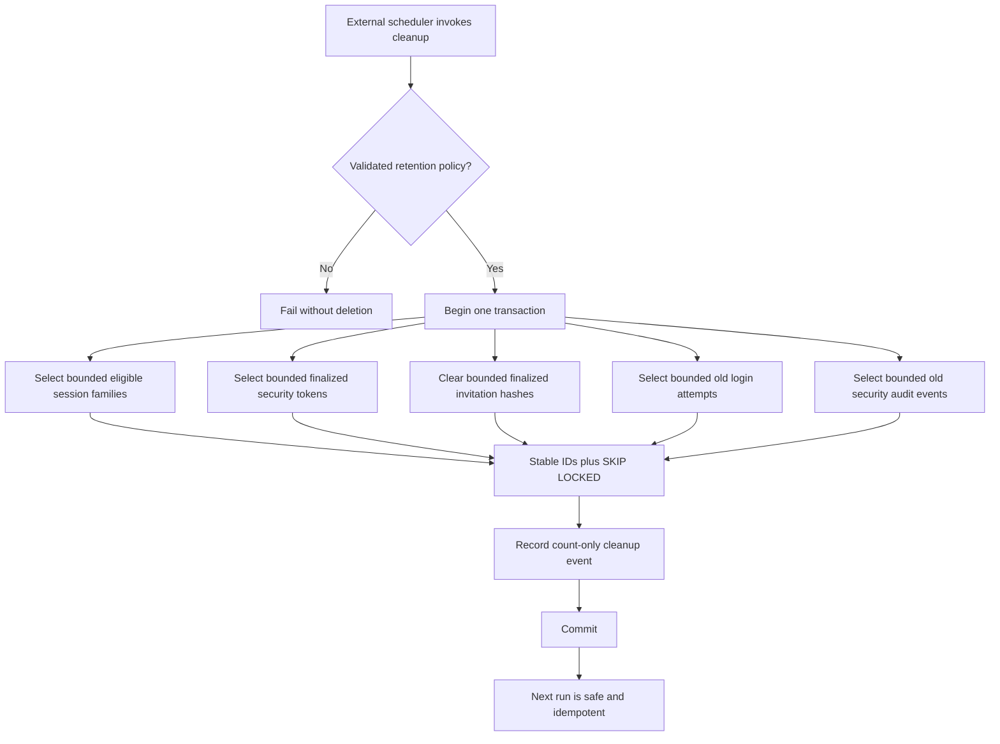

# Phase 5 Key, Session, and Recovery Hardening

## Scope

Phase 5 reviewed and hardened signing-key rotation, access-token verification,
logical refresh sessions, individual and bulk session revocation, recovery and
verification token primitives, organization invitations, password hashing,
security-event retention, and bounded cleanup.

This phase does not claim that ZinharCMS has a public password-reset,
email-verification, email-change, MFA, or recent-reauthentication product flow.
It adds the internal token foundation those future flows must use. The cleanup
implementation is callable application code; no scheduler or worker was added.
No commit, stage, push, production access, production deployment, secret
rotation, or external user notification was performed.

## Starting Repository State

- Branch: `security/security-audit-fixes`.
- Starting commit: `5c3f4d110f807e66239fec8bbf37c56f9cbb92aa`.
- Starting subject: the completed Phase 4 checkpoint.
- The tracked working tree was clean at the beginning of the phase.
- Migrations were authoritative through `0027`; Phase 5 adds `0028`.
- The repository and Git state were treated as authoritative when older OKF
  descriptions differed.

## Inherited Findings

The exact related stable findings from earlier phases were:

| Finding | Earlier status | Phase 5 treatment |
| --- | --- | --- |
| `SEC-P01-003` | Closed for browser credential persistence in Phase 3 | Closure preserved. Session inventory is not persisted in browser storage. |
| `SEC-P01-007` | Closed by authoritative identity/version checks in Phase 2 | Closure preserved and used by logout-all and privileged bulk revocation. |
| `SEC-P01-008` | Closed by transactional family rotation/reuse handling in Phase 2 | Closure preserved and extended with per-user serialization against revocation. |
| `SEC-P01-001` | Source path fixed; deployment/account incident response remains an owner action | Not closed by this phase. |
| `SEC-P01-019` | Deployment controls unverified | Still open for deployed TLS, secret injection, log handling, and runtime configuration. |

Earlier reports did not assign a dedicated stable finding ID to signing-key
rotation, end-user session inventory, public account recovery, or retention
scheduling. Phase 5 does not invent an inherited ID for those gaps.

## Cryptographic Asset Inventory

| Asset and evidence | Construction / purpose | Source, storage, and scope | Identifier, rotation, and expiry | Exposure and failure behavior |
| --- | --- | --- | --- | --- |
| JWT signing keys (`config.rs`, `jwt.rs`) | HS256 HMAC secrets; each key must contain at least 32 non-placeholder UTF-8 bytes; signs/verifies access JWTs | `JWT_KEY_RING` environment JSON, backend process memory only; symmetric material must reach every verifier | Unique `kid`; exactly one active signer; bounded previous verifier using integer Unix `verify_until`; retired/removed keys reject; access TTL configurable | Never returned to browser or stored in PostgreSQL; startup fails closed for malformed, weak, duplicate, unsupported, or ambiguous configuration; generic verification errors do not expose cause |
| Access JWT (`jwt.rs`, auth middleware) | Compact HS256 bearer with `sub`, `role`, `ver`, `iat`, and `exp`; signature verified before claims | Not persisted server-side; held only in volatile browser/module state and sent in Authorization | Active `kid`; maximum configured access lifetime; authoritative active-user/role/`auth_version` check on protected requests | Not intentionally logged or stored in browser storage/URLs; malformed/unknown/retired/expired/stale tokens receive a generic invalid response |
| Refresh credential and family (`sessions.rs`) | 32 OS-random bytes (256 bits), base64url; SHA-256 lookup hash; browser session continuity | Raw value only in scoped HttpOnly cookie; hash and linked one-time rows in PostgreSQL | Opaque public family UUID; absolute family expiry; atomic rotation; reuse compromise; current/owned/all/privileged revocation | Raw value is not JSON, JavaScript-readable storage, inventory, audit, or logs; invalid/reused/revoked values fail generically and may clear the cookie |
| Preview WebSocket ticket (`preview_tickets.rs`) | 32 OS-random bytes; SHA-256-derived Redis key; authorizes one scoped preview connection | Raw value exists transiently in browser memory and WebSocket subprotocol; hashed Redis key and scoped record | No general `kid`; default 30-second/max 60-second TTL; Redis `GETDEL` single use | Not placed in URL or persistent browser storage and not intentionally logged; Redis failure denies issuance/connection |
| Organization invitation (`organizations.rs`, `invitations.rs`, `email.rs`) | 32 OS-random bytes; SHA-256 lookup hash; bearer-equivalent membership invitation | Hash only while pending; raw value only in the outbound email path and transient accept form state | Seven-day expiry; pending-row replacement; atomic single use; hash erased on acceptance/revocation/expiry | No longer returned to administrative clients or stored in delivery payloads; removed from browser history after capture; first-hop email/URL infrastructure can still observe it |
| Recovery/verification foundation (`security_tokens.rs`) | 32 OS-random bytes; SHA-256 token/binding hashes; exact user and purpose binding | Hash only in `security_tokens`; raw value returned only to the immediate internal caller; no public/browser route | Purpose is reset, email verification, or email change; one-hour reset/change maximum, 24-hour verification maximum; supersession, five/hour issuance bound, revoke, and atomic single use | No raw value in database/audit/logs; generic rejection; internal service fails for inactive user, invalid TTL, rate excess, wrong binding/purpose/user, expiry, revoke, or reuse |
| Password credential (`password.rs`, auth routes) | Argon2id v19, `m=19456 KiB`, `t=2`, `p=1`, 32-byte output, fresh OS-random salt | Encoded hash in `users`; plaintext exists only in request/verification memory | No key identifier or expiry; existing password mutation model increments `auth_version`; public reset/change flow is absent | Plaintext/hash not intentionally logged or returned; inputs over 1,024 bytes or containing NUL fail before expensive work; malformed stored hashes fail internally |
| CMS webhook secret (`webhooks.rs`) | 32 OS-random bytes when backend-generated (or 32 browser-random bytes in Settings); HMAC-SHA256 signs outbound payloads | Stored raw in tenant webhook row because signing requires it; tenant-management API/UI can handle it | No `kid` or TTL; an authorized update can replace it; minimum accepted supplied length is 16 characters | Not intentionally logged; existing API exposure to authorized webhook managers and rotation policy were inventoried but not redesigned in Phase 5 |
| Stripe/API/provider credentials (`config.rs`, `stripe_billing.rs`, email provider) | Provider-defined secret; Stripe webhook uses HMAC-SHA256 with a five-minute signature tolerance | Backend environment only; optional values held in process memory; `VITE_API_URL` is public and must not contain secrets | Provider/operator rotation; no application `kid`; no repository-owned expiry | Not sent to frontend or intentionally logged; absent optional values make related provider operations unavailable rather than enabling a secret fallback |
| Database/Redis connection credentials (`Config`, Compose) | Provider connection authentication; not an application cryptographic primitive | Backend environment/Compose; never a browser build input | Operator-managed rotation; no application identifier/expiry | Database configuration is required; Redis has a local uncredentialed development default; deployed secret injection and redaction remain unverified |
| Bootstrap administrator credential (`main.rs`, `Config`) | Explicit email/password pair; password uses the same Argon2id storage | Environment only at startup, then encoded password hash in `users`; empty-database scope | No automatic generated fallback; operator must remove and rotate bootstrap inputs after use | Pair validation fails startup when incomplete/weak; values are not logged, but earlier owner-side account/credential investigation remains open |
| Domain ownership challenge (`organization_domains`) | Database-generated UUID-form challenge; proves future DNS/domain control rather than account authentication | Stored and returned raw to authorized organization administrators | No TTL, rotation, or consume transition is currently implemented | Deliberately visible to the tenant administrator and not an auth bearer; lifecycle remains an informational deferred design |
| Marketplace artifact digest (`marketplace_package.rs`) | SHA-256 integrity checksum, not a secret or credential | Stored with package metadata and object key; may be returned in authorized/catalog data | Changes with artifact; no rotation/expiry | Public/metadata exposure is expected; mismatch rejects tampered bytes |

No raw token, signing secret, password, cookie, authorization header, private
certificate, provider credential, or test credential is reproduced in this
report.

## Existing JWT Signing Model

The starting implementation used one symmetric secret without a `kid`. Every
access token depended on that single value, so an immediate replacement
invalidated all access tokens while overlapping keys could not be selected
deterministically. The service already used HMAC verification and authoritative
database identity checks, but it did not provide an operationally bounded
rotation contract.

## JWT Key-Ring Design

`JWT_KEY_RING` is a JSON array with at most eight records. Each record contains
a restricted key identifier, exact `HS256` algorithm, status, secret, and—only
for a previous key—a `verify_until` Unix timestamp in integer seconds. Startup
requires:

- exactly one active key;
- unique restricted `kid` values;
- exact HS256;
- at least 32 bytes of non-placeholder secret material;
- no verification cutoff on the active key;
- a previous-key cutoff no later than the current time plus the access-token
  lifetime and 30-second validation skew;
- no verification eligibility for retired keys.

New tokens always use the one active key.



## Key Identifier and Algorithm Policy

The protected JWT header must contain only `alg`, `typ`, and `kid`.
`alg` must be exactly `HS256`, `typ` must be exactly `JWT`, and `kid` must
select one configured active or unexpired previous key. Verification does not
try all keys, downgrade algorithms, accept unknown fields, accept unknown key
identifiers, or use retired keys.



## Legacy Token Compatibility

Legacy access tokens without `kid` are rejected immediately. This is the
deliberate zero-window compatibility policy: the refresh cookie can bootstrap a
new access token signed by the active key, while carrying an ambiguous legacy
key-selection rule would extend exposure and complicate incident retirement.
Users whose refresh family remains valid recover through the existing refresh
path; otherwise they authenticate again.

## Key Rotation Procedure

1. Generate new high-entropy key material outside source control and assign a
   new unique `kid`.
2. Preserve the old active key as `previous` with a cutoff no later than the
   maximum existing access-token lifetime plus allowed skew.
3. Deploy the new ring atomically with exactly one `active` key.
4. Confirm new JWT headers use the new `kid` and old valid access JWTs verify
   only before the previous-key cutoff.
5. After the cutoff, change the old key to `retired` or remove it and confirm
   unknown/retired key tests reject it.
6. For suspected compromise, retire/remove the key immediately; use bulk
   session revocation and `auth_version` changes where account-level invalidation
   is also required.

The repository validates this shape but cannot prove secret-manager rollout,
deployment atomicity, owner approvals, or incident execution.

## Session Family Model

One login or registration creates one logical refresh-token family. Tokens
inside the family remain hashed and one-time. Phase 5 adds a separate random
UUID public identifier, last-use timestamp, and controlled revocation reason.
The public identifier is not the internal family key, token hash, or a
credential.

No IP address, user-agent string, device fingerprint, or location is added to
the session inventory. This avoids creating a new personal-data collection
surface without an approved privacy and retention purpose.

## Session Inventory Design

`GET /api/auth/sessions?page=<n>&per_page=<n>` returns the caller's non-expired
logical families in deterministic newest-first order. Page size is bounded to
1–100. The current family is recognized only by hashing the presented refresh
cookie and comparing it inside the backend; no raw token or hash is returned.
The React Settings page renders values as ordinary text and does not persist
inventory data.

```mermaid
sequenceDiagram
    participant B as Browser
    participant A as Auth route
    participant S as Session service
    participant D as PostgreSQL
    B->>A: GET /api/auth/sessions with bearer access
    A->>S: user id, optional refresh cookie hash, bounded page
    S->>D: select non-expired families by opaque public id
    D-->>S: logical session rows
    S-->>A: page and current-session flag
    A-->>B: metadata only; no raw token or token hash
    B->>A: DELETE /api/auth/sessions/{public_id}
    A->>S: authoritative user plus Origin check
    S->>D: advisory lock, ownership check, revoke family
    D-->>S: idempotent result and security event
    S-->>B: revoked status; clear cookie if current
```

## Individual Session Revocation

`DELETE /api/auth/sessions/{session_id}`:

- requires a valid access token and authoritative current identity;
- validates browser Origin for the destructive cookie boundary;
- accepts only an opaque public UUID;
- serializes against refresh and bulk revocation for that user;
- checks ownership in the transaction;
- revokes the complete family and current token rows;
- is generic and idempotent for missing/cross-user identifiers;
- clears the browser cookie when the selected family is current;
- records a controlled global security event without credential material.

## Logout-All Design

`POST /api/auth/logout-all` takes the per-user advisory transaction lock,
revokes every family, increments the user's `auth_version`, and records a
count-only security event in the same transaction. The route validates browser
Origin, clears the cookie, and the frontend clears/broadcasts volatile
authentication state.



## Privileged Session Revocation

`POST /api/auth/admin/users/{user_id}/revoke-sessions` is not a tenant-admin
capability. It rechecks the caller's current database identity and exact global
role and allows only `super_admin`. It uses the same target-user lock, revokes
all target families, increments the target authentication version, and records
actor/target IDs with count-only metadata. A stale JWT role claim cannot grant
the operation.

Recent reauthentication or step-up authentication is not implemented because
the current access-token/session schema has no `auth_time` or step-up state.
That is an explicit residual control gap, not an implicit success.

## Account Recovery Inventory

No existing public password-reset, forgotten-password, email-verification,
email-change confirmation, recovery-code, MFA recovery, or account-unlock flow
was found. Organization invitations were the only existing email-delivered
account-bound bearer workflow in scope.

Phase 5 adds an internal `security_tokens` service and table for
`password_reset`, `email_verification`, and `email_change`. Adding this
foundation does not make the absent routes or product flows implemented.

## Recovery and Verification Token Policy

The internal issuer:

- generates 256 random bits using the OS CSPRNG;
- returns the raw token only to its immediate caller and stores only SHA-256;
- binds every record to one active user and one exact purpose;
- optionally binds a normalized target value through a separate hash;
- serializes issuance by user and purpose;
- supersedes outstanding tokens for the same user/purpose;
- limits issuance to five per user/purpose per rolling hour;
- enforces a maximum one-hour lifetime for reset/email-change and 24 hours for
  email verification.

Consumption validates shape, purpose, user, optional binding, expiry, revoked
state, and consumed state under a row lock, then marks exactly one row consumed.
Concurrent consumption has one winner. Reuse is denied and audited with no raw
token. Public request throttling by authoritative client IP is deferred because
there is no public recovery request route yet.

## Password Reset Security

No password-reset endpoint was implemented or claimed. The required future
transaction is:

```mermaid
sequenceDiagram
    participant U as User
    participant R as Future recovery route
    participant T as Security token service
    participant D as PostgreSQL
    Note over U,D: Design plus internal token foundation; public flow not implemented
    U->>R: submit opaque reset token and new password
    R->>T: consume exact purpose, user, and optional binding
    T->>D: row lock and single-use consume
    R->>D: update explicit Argon2id password hash
    R->>D: increment auth_version and revoke all families
    R->>D: revoke outstanding reset tokens and audit counts
    D-->>R: one atomic commit
    R-->>U: generic success response
```

Any future implementation must make token consumption, password update,
authentication-version increment, all-session revocation, reset-token
supersession, and audit insertion one transaction. It must also use generic
request/consume responses to limit account enumeration and add public
rate-limiting. Those end-to-end properties were not executable in Phase 5
because the route does not exist.

## Invitation Token Security

Invitation issuance continues to use a 256-bit random bearer token and stores
only its SHA-256 hash. Phase 5 additionally:

- stops returning the raw token/link in the administrative API response;
- stops persisting the raw invitation link or email body in
  `email_deliveries.payload`;
- redacts historical invitation-delivery payloads in migration `0028`;
- clears the database token hash on acceptance, revocation, or expiry;
- atomically locks and consumes one pending invitation;
- rechecks recipient email, active user, active organization, server-side role,
  and membership capacity in the transaction;
- preserves the invitation's server-side role instead of accepting client role
  input;
- allows exactly one winner during concurrent acceptance;
- locks the shared organization row before capacity evaluation, so different
  invitation tokens cannot race the same membership quota;
- removes the `invite` query parameter from browser history immediately after
  capture.

The initial invitation email still has to deliver a bearer-equivalent link.
Before the frontend removes it, the URL can be visible to the recipient's email
client and the first serving/ingress layer. Operators must use HTTPS, avoid
query logging, set an appropriate referrer policy, and limit link analytics.

## Password Hashing Review

Password hashing now explicitly uses Argon2id version 19 with 19,456 KiB memory,
two iterations, one lane, and a 32-byte output. Every hash receives a fresh
OS-random salt. Verification uses the library verifier against the encoded
parameters. Inputs over 1,024 UTF-8 bytes or containing NUL are rejected before
expensive work.

Registration still has an eight-character minimum. Breached-password screening,
password history, rehash-on-login, password change UX, and MFA are not added.
The chosen cost is a documented application baseline; production latency and
capacity benchmarking remains an operator/engineering requirement.

## Secret Configuration Validation

The obsolete single `JWT_SECRET` contract is replaced in environment examples,
CI, production Compose, README, architecture, API, and relevant OKF documents.
Startup errors identify the invalid field/policy but never echo key material.
Tracked examples contain placeholders only. This phase does not select or
integrate a production secret manager.

## Security Data Retention

Default technical retention policy:

| Data | Default | Treatment |
| --- | --- | --- |
| Expired refresh families | 30 days | Eligible for bounded deletion |
| Revoked refresh families | 30 days | Eligible for bounded deletion |
| Compromised refresh families | 180 days | Retained longer for investigation |
| Finalized/expired recovery-verification tokens | 7 days | Hash records eligible for deletion |
| Invitation bearer hashes | Immediate on final state/expiry | Metadata remains; hash is cleared |
| Login attempts | 30 days | Eligible for bounded deletion |
| Global security audit events | 365 days; validated minimum 90 days | Eligible for bounded deletion |
| Tenant `audit_logs` | Existing application policy | Not deleted by Phase 5 cleanup |

These defaults are technical safeguards, not a legal retention determination.
Privacy, regulatory, litigation-hold, incident-response, and contractual
requirements require owner approval.

## Cleanup Execution Model

`security_cleanup::run_cleanup` executes one database transaction. Each table
uses a stable-ID candidate CTE, a per-table batch bound, and
`FOR UPDATE SKIP LOCKED`. Active/non-expired sessions and active security tokens
are preserved. Repeated execution is idempotent after eligible rows are gone.
Only count metadata is added to the cleanup security event.



No in-process timer, cron definition, queue worker, monitoring rule, or retry
owner exists in the repository. A deployment owner must schedule and observe
the callable cleanup.

## Audit Event Policy

`security_audit_events` is a global identity/security audit store, distinct from
tenant `audit_logs`. Phase 5 records selected session revocations, logout-all,
privileged revocation, recovery-token issuance/consumption/reuse/revocation,
invitation acceptance, and cleanup completion.

Metadata must be a JSON object. The writer rejects top-level field names
associated with authorization, cookies, hashes, passwords, secrets, and tokens.
Callers use controlled counts, current-session flags, purposes, organization
IDs, and authentication versions. The writer is not a recursive universal
redactor or tamper-evident log. SIEM export, alerting, immutable storage, and a
complete event matrix remain absent.

## Database Migration Strategy

Migration `0028_security_phase_five_key_session_recovery.sql` is additive:

- adds opaque public IDs, last-used timestamps, reasons, and indexes to refresh
  families;
- makes invitation hashes nullable so final states can erase credentials;
- redacts historical invitation-delivery payloads;
- adds `security_tokens` constraints and cleanup indexes;
- adds global `security_audit_events`;
- adds a login-attempt cleanup index.

It was exercised both from an empty database and as a `0027` to `0028` upgrade
using a temporary application role configured `NOSUPERUSER NOBYPASSRLS`.
No down migration is added because the repository uses forward-only SQLx
migrations. Rollback requires an owner-approved backup/restore or forward fix;
it must not be improvised by deleting migration history.

## Compatibility Impact

- `JWT_SECRET` deployments will fail startup until they provide a valid
  `JWT_KEY_RING`.
- Legacy access tokens without `kid` are invalid immediately; valid refresh
  cookies can bootstrap new access tokens.
- An incorrect previous-key cutoff is rejected at startup.
- Invitation-create responses no longer include a raw token or acceptance link;
  administrative clients must treat email delivery as the only bearer-delivery
  path.
- Existing invitation delivery payloads are intentionally redacted.
- Session inventory adds authenticated API surface without changing existing
  login/refresh response shapes.
- Logout-all invalidates all existing access tokens through `auth_version`.
- Migration `0028` is required before the new backend starts.
- Existing initialized PostgreSQL volumes do not rerun init scripts; application
  role attributes require explicit operator verification.

## Confirmed Phase 5 Findings

| ID | Severity / confidence | Property and type | Affected files and evidence | Realistic impact | Remediation, regression evidence, and operations |
| --- | --- | --- | --- | --- | --- |
| `SEC-P05-001` | High / Confirmed | Insecure key-management design and access-token lifecycle: the single no-`kid` secret had no deterministic bounded rotation model; no key exposure was confirmed | `config.rs`, `jwt.rs`, environment templates, CI, and production Compose showed one static verifier input | Rotation either invalidated every access token or encouraged indefinite old-secret retention; a compromised key could not be retired with deterministic overlap | Remediated with strict active/previous/retired key-ring parsing, exact header selection, unit tests, and real A-to-B browser rotation. Operator must provision and rotate the ring through an external secret path |
| `SEC-P05-002` | High / Confirmed | Missing session control and token invalidation | `sessions.rs`, `auth.rs`, Settings API/UI lacked inventory, owned revoke, logout-all, and incident bulk revoke | A user or incident responder could not selectively terminate a stolen logical session or atomically invalidate all account authority | Remediated with opaque paginated inventory, owned/current revoke, logout-all, exact-super-admin bulk revoke, `auth_version`, audit, live cross-user/race tests, frontend tests, and browser evidence. Recent reauthentication remains an owner decision |
| `SEC-P05-003` | High / Confirmed | Temporary bearer exposure and invitation transaction boundary | `organizations.rs` returned the raw link, `email.rs` persisted delivery body/link, and acceptance did not share one locked capacity/consume service | An authorized administrative client, database reader, log/export path, or race could retain/replay invitation authority or exceed member capacity | Remediated with API/storage redaction, migration redaction, final-state hash erasure, recipient/role/org binding, organization quota lock, distinct-token and same-token concurrency tests, and browser history removal. HTTPS/ingress query redaction remains operational |
| `SEC-P05-004` | Medium / Confirmed | Password-hashing configuration and resource-bound defense in depth | `password.rs` used implicit crate defaults and accepted unbounded expensive input | Dependency-default drift or oversized requests could change cost assumptions or amplify authentication resource use; password disclosure was not demonstrated | Remediated with explicit Argon2id parameters, random-salt/parameter tests, and 1,024-byte/NUL bounds. Production capacity benchmarking and rehash policy remain operational/deferred |
| `SEC-P05-005` | Medium / Confirmed | Account-recovery design gap: no reusable secure token primitive existed; no exploitable public recovery endpoint existed | Repository inventory found no reset/verification/change route or token table | A future ad hoc flow could otherwise store raw, reusable, long-lived, or weakly bound credentials; existing users were not exposed through a nonexistent flow | Internal hash-only purpose/user/binding-bound foundation implemented with expiry, supersession, issuance bound, revoke, single-use concurrency, expiry, and audit tests. Public enumeration-resistant flow and atomic password/session mutation remain deferred |
| `SEC-P05-006` | Medium / Confirmed | Privacy/retention and security-evidence lifecycle | Session families, login attempts, temporary token rows, and security events had no bounded cleanup implementation | Indefinite security/personal record growth increases exposure and operational load; overly aggressive deletion could erase incident evidence | Validated defaults plus bounded stable-ID `SKIP LOCKED` cleanup implemented; live tests cover eligibility, compromised retention, idempotence, concurrent runs, and rollback. Scheduling/legal approval remains an owner action |
| `SEC-P05-007` | High / Confirmed | Weak operational RLS configuration in the existing local Compose volume | Read-only role inspection showed local `cms_user` with `SUPERUSER` and `BYPASSRLS`; tracked `postgres-init-app-user.sh` correctly specifies the opposite for fresh volumes | Tests or local operation through that stale role can bypass forced RLS and provide false isolation confidence | Open owner action. All Phase 5 live tests used a separate verified `NOSUPERUSER NOBYPASSRLS` role; the existing role was not silently changed. Every deployed/existing volume requires inspection and an approved correction procedure |
| `SEC-P05-008` | Low / Confirmed | Invitation bearer privacy/retention in browser history | `OrganizationPage.tsx` captured `invite` but left it in `location.search` | History, screenshots, referrers, or client telemetry could retain the invitation bearer after use | Remediated with immediate `history.replaceState`, unit/static review, and real-browser query removal. Initial email and first-hop URL exposure remains |
| `SEC-P05-009` | Informational / Confirmed | Domain-challenge lifecycle documentation gap | `organization_domains.verification_token` is a raw UUID-form value returned to authorized tenant administrators with no verified consume/expiry flow | No account-authentication impact was confirmed; a future domain-verification implementation could inherit an undefined rotation/expiry contract | Inventoried and deferred because domain verification is outside Phase 5 account-recovery scope. Define entropy, TTL, rotation, verification, and cleanup before relying on it |

No Critical finding was confirmed in the Phase 5 scope. Absence of a confirmed
Critical finding is not a claim that the product or deployment has no Critical
risk outside this scope.

## Earlier Findings Closed

No earlier open finding was newly reclassified as closed by Phase 5. The
existing closures for `SEC-P01-003`, `SEC-P01-007`, and `SEC-P01-008` were
preserved and extended. `SEC-P01-001`, `SEC-P01-019`, and other earlier
deployment/owner actions remain open.

## Changes Applied

- Replaced single JWT configuration with a validated active/previous/retired
  key ring.
- Added strict header/claim/time/size verification and key-rotation tests.
- Added opaque logical-session inventory, revoke-one, logout-all, and
  super-admin bulk revocation APIs and UI.
- Serialized refresh and revocation using per-user PostgreSQL advisory
  transaction locks.
- Added global controlled security events.
- Added a hashed, single-use recovery/verification token foundation.
- Hardened invitation delivery storage, API response, atomic acceptance, hash
  erasure, and browser URL cleanup.
- Pinned Argon2id parameters and bounded password inputs.
- Added configurable, bounded, idempotent security cleanup.
- Added migration `0028`, focused unit/integration/frontend tests, environment
  templates, CI configuration, and documentation updates.

## Validation Results

The final serialized validation matrix passed:

- fresh migration application under a temporary non-superuser/no-bypass role;
- `0027` to `0028` upgrade migration;
- key-ring parser and JWT active/previous/unknown/retired/legacy/algorithm tests;
- password parameter, random-salt, and input-bound tests;
- live refresh-versus-revocation race, cross-user isolation, pagination,
  logout-all, unrelated-user preservation, and privileged-role boundary tests;
- live recovery-token hash-only storage, binding/purpose/user rejection,
  explicit expiry, issuance bound, single concurrent winner, revocation, reuse,
  and controlled-audit-event tests;
- live invitation same-token and distinct-token concurrent acceptance,
  server-side role/capacity preservation, and post-finalization hash erasure;
- live cleanup boundedness, idempotency, active-row preservation, longer
  compromised-session retention, security-event retention, concurrent runs, and
  rollback after a mid-transaction foreign-key failure;
- Rust formatting and strict Clippy across all targets and features;
- the complete all-feature backend suite: 180 unit tests, two live Phase 2
  integration tests, one Phase 5 migration integration test, and zero doc-test
  failures;
- frontend lint, TypeScript type checking, the one-approved-sink policy, 47
  tests in 12 files, and a production build;
- local and production Compose interpolation/configuration;
- production-bundle browser checks for registration, invitation URL scrubbing,
  bounded previous-key verification, refresh bootstrap after A-to-B rotation,
  session inventory without browser persistence, individual revocation, and
  logout-all;
- the exact 34 report headings and six English Mermaid diagrams;
- changed-file English-language, production-shaped secret, credential
  persistence, mojibake, and Git whitespace scans.

The two temporary databases and both temporary roles were subsequently removed
and verified absent. Browser helper files/profiles were removed, related
services were stopped, and no test listener remained on ports 8080, 5173, or
9333.

## Failed or Unavailable Checks

The implementation used deliberate red-green tests. Expected initial failures
included missing key-ring/session/recovery/cleanup/invitation functions,
unbounded password input, persisted invitation delivery content, and absent
Settings session UI. Those failures drove the implementations and their focused
tests later passed.

- One Settings test initially retained DOM because cleanup was not registered;
  the harness was corrected with `afterEach(cleanup)` and the full suite passed.
- The first final backend run exposed a stale expected migration version of 27;
  the assertion was updated to 28 and the complete rerun passed.
- Strict Clippy exposed one needless `as_bytes()` call; it was corrected and
  the strict rerun passed.
- Two cleanup fixtures initially modeled expiry/concurrency incorrectly; their
  timestamps and guarded-row lifecycle were corrected, the disposable database
  was recreated, and the expanded final suite passed.
- Independent Cargo commands briefly contended for the build-directory lock;
  all final Cargo validation was serialized.
- The sandboxed Vitest launch could not spawn esbuild (`EPERM`); the explicitly
  approved equivalent rerun passed all 47 tests.
- The Browser plugin was unavailable before tab creation because its
  JavaScript kernel-assets path could not be created. A disposable headless
  Edge/CDP fallback exercised the real production bundle and passed the listed
  browser checks.
- The Vite development page could not execute because the strict Phase 4 CSP
  blocks Vite's injected inline React-refresh bootstrap. The production build
  and production-bundle browser path passed without weakening CSP. Development
  tooling compatibility remains deferred.

`cargo audit` was not run because the subcommand is not installed and this phase
did not authorize installation or external advisory-metadata retrieval.
`npm audit --omit=dev` was likewise not run because it would transmit dependency
metadata externally. No production or staging environment was accessed.

## Operational Requirements

- Provision `JWT_KEY_RING` through an approved secret manager or equivalent
  protected deployment mechanism; never copy tracked placeholders.
- Execute rotation with one active key and a bounded previous-key cutoff; retain
  rollback/incident evidence without retaining keys longer than policy allows.
- Back up and test restore before deploying migration `0028`.
- Verify the real application PostgreSQL role is `NOSUPERUSER NOBYPASSRLS` on
  every existing environment; fresh-volume init scripts alone are insufficient.
- Schedule `security_cleanup::run_cleanup` with monitoring, alerting, retry, and
  documented ownership.
- Review the technical retention defaults with privacy, legal, security, and
  operations owners.
- Use HTTPS and suppress/redact invitation query strings in ingress, analytics,
  tracing, referrers, support captures, and email-link tooling.
- Benchmark the explicit Argon2id parameters under expected production load.
- Define recent-reauthentication/step-up requirements for logout-all and
  privileged revocation.
- Keep global security-event metadata credential-free and decide SIEM/export
  ownership.

## Residual Risks

- Production secret storage, rotation execution, TLS, logging, and deployed
  cookie posture remain unverified.
- Legacy no-`kid` access tokens are deliberately invalidated immediately,
  creating a bounded compatibility interruption for clients without a valid
  refresh family.
- Live-memory access tokens remain reachable to successful same-origin script
  execution; Phase 4 CSP/sanitization are defense in depth, not an XSS immunity
  claim.
- Invitation bearers appear in the initial email URL and can reach first-hop
  infrastructure before browser removal.
- Session metadata intentionally lacks device/IP/user-agent context, limiting
  user recognition of sessions but avoiding new personal-data collection.
- No recent reauthentication, step-up authentication, MFA, recovery code, or
  device binding is implemented.
- The cleanup service has no repository-owned scheduler or alert.
- Global security events are not tamper-evident and do not cover every security
  decision.
- The observed existing local Compose application role requires owner-managed
  correction before its RLS behavior can be trusted.
- The strict production CSP is incompatible with Vite's injected development
  React-refresh bootstrap; production behavior passed, but the repository needs
  a separate safe development-tooling design.
- The domain-ownership UUID challenge has no implemented TTL, rotation, consume
  transition, or cleanup contract.

## Deferred Areas

- Public forgot-password/reset-password flow and enumeration-resistant request
  responses.
- Email verification and email-change confirmation product flows.
- MFA, recovery codes, passkeys, federation, and step-up authentication.
- Rehash-on-login and breached-password screening.
- Production secret-manager integration and automated rotation orchestration.
- Cleanup scheduling, metrics, alerts, and operational dashboards.
- SIEM export, immutable/tamper-evident audit storage, and full event taxonomy.
- Approved session device metadata/privacy model.
- Domain-ownership challenge lifecycle and cleanup.
- CSP-compatible local frontend development tooling without weakening
  production policy.
- Owner response for earlier credential/account and deployment findings.

## Recommended Next Phase

Proceed to the next planned security phase only after the owner verifies and,
with an approved backup/change procedure, corrects every existing application
database role to `NOSUPERUSER NOBYPASSRLS`, provisions a real key ring through
the deployment secret path, and assigns cleanup scheduling/retention ownership.
The next implementation phase should then address the highest-priority
remaining inherited security findings rather than treating the new recovery
token foundation as a completed public recovery feature.
