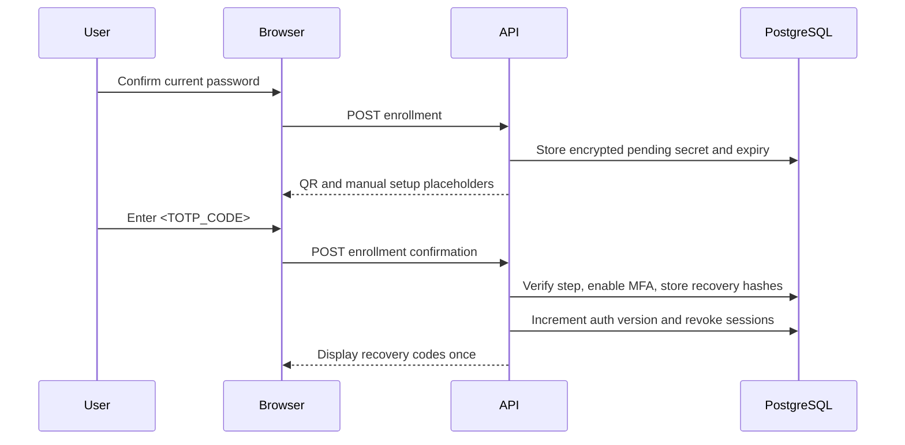
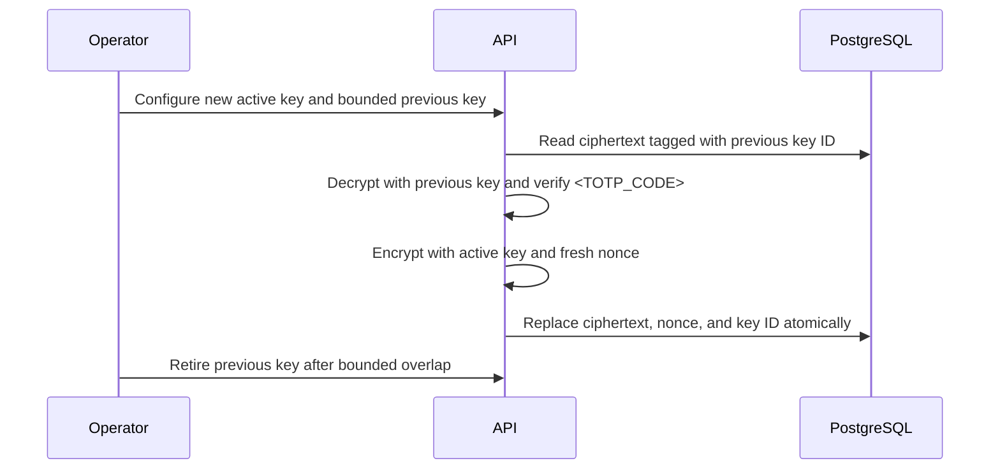
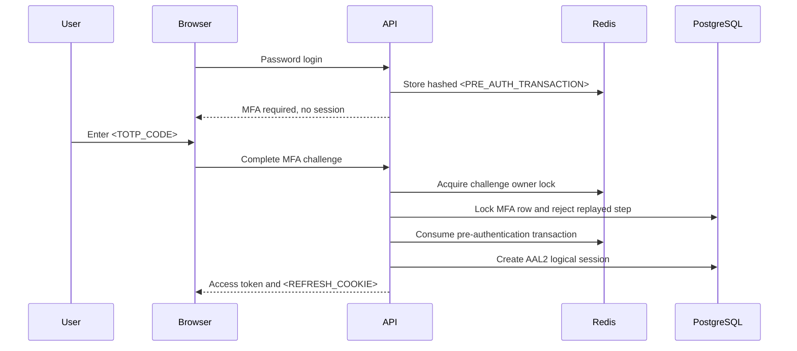
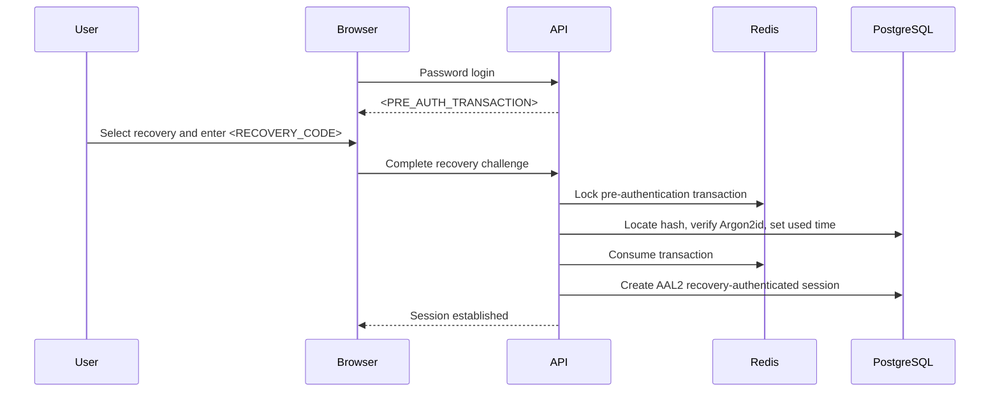
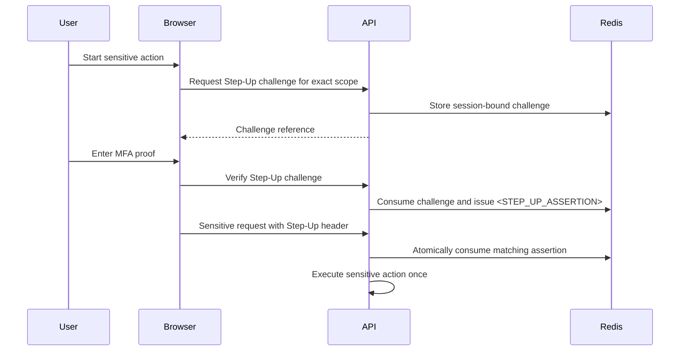
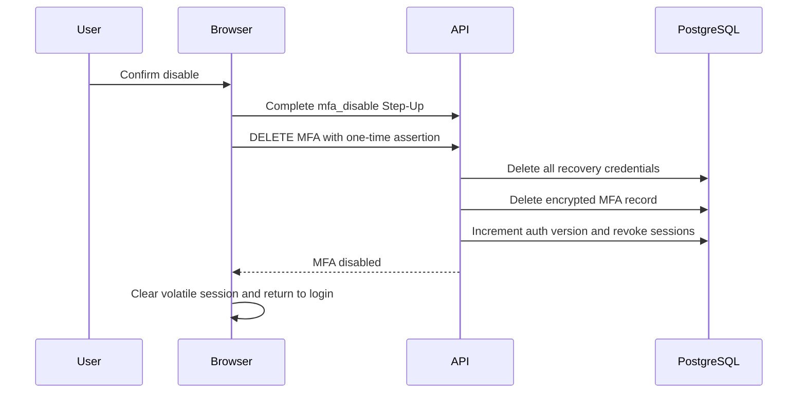
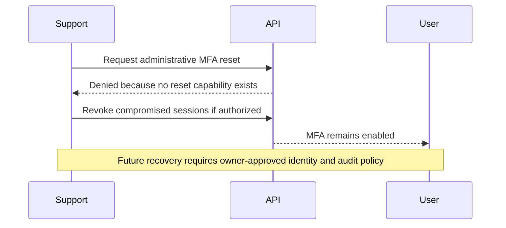

# Phase 6 MFA, TOTP, and Step-Up Hardening

## Scope

Phase 6 adds standards-compatible TOTP MFA, one-time recovery codes, login
pre-authentication, authentication assurance context, and scope-bound Step-Up
Authentication. It also inventories sensitive operations, encrypts MFA secrets
at rest, preserves Phase 1-5 authentication and tenant controls, and verifies
the implementation with live PostgreSQL, Redis, and browser flows.

This phase does not add SMS OTP, email OTP, passkeys, federation, a public
password-reset product flow, or an administrative MFA-reset capability.

## Starting Repository State

Work started on `security/security-audit-fixes` at
`0f9fc4e9e927089cf2ebef9183237d4955c16921` with an empty index and clean
working tree. That commit contains the completed Phase 5 key, session,
invitation, and recovery-token hardening. No branch switch, commit, push,
history rewrite, staging deployment, or production access occurred in Phase 6.

## Inherited Findings

- `SEC-P05-002` was already remediated for session inventory and revocation,
  but its explicitly recorded recent-reauthentication decision remained open.
  Phase 6 closes that residual gap for the selected sensitive-action matrix
  through MFA-backed Step-Up Authentication.
- `SEC-P05-005` remains the authoritative account-recovery finding. Its
  hash-only internal token foundation is preserved, but no public
  password-reset flow exists.
- `SEC-P05-007` remains open: the pre-existing local `cms_user` role was
  observed in Phase 5 as `SUPERUSER BYPASSRLS`. All Phase 6 live database work
  used a separate verified `NOSUPERUSER NOBYPASSRLS` role.
- Phase 1 closures for `SEC-P01-003`, `SEC-P01-007`, and `SEC-P01-008`, plus
  Phase 2-5 session, RLS, browser-token, CSP, Trusted Types, and JWT key-ring
  guarantees, remain preserved.

No earlier report assigned a finding ID specifically to missing MFA or missing
Step-Up Authentication, so this report does not invent one.

## Authentication Assurance Model

| Level | Required evidence | Session representation | Permitted use |
| --- | --- | --- | --- |
| `AAL1` | Password or a valid refresh rotation derived from password authentication | `aal=1`, `amr=["pwd"]`, password authentication time | Normal authenticated access |
| `AAL2` | Password followed by TOTP or a one-time recovery code | `aal=2`, `amr=["pwd","totp"]` or `["pwd","recovery"]`, MFA time | Normal access plus eligibility to initiate Step-Up |
| `STEP_UP` | A fresh MFA proof in an existing `AAL2` logical session | One-time Redis grant bound to user, session, auth version, exact scope, and expiry | Exactly one matching sensitive request |

Access middleware reloads the logical refresh family and current user identity.
It rejects revoked, compromised, expired, stale-version, or claim/context
mismatches. Refresh rotation preserves the established authentication context.

## Sensitive Action Inventory

The central policy in `backend/src/middleware/step_up.rs` protects:

| Scope | Protected mutations |
| --- | --- |
| `session_logout_all` | Logout-all and owned session revocation |
| `privileged_session_revocation` | Super-admin incident revocation for another user |
| `mfa_disable` | MFA disable |
| `mfa_recovery_regenerate` | Recovery-code replacement |
| `organization_administration` | Member, invitation, domain, transfer, rate-limit, and plugin administration |
| `webhook_administration` | Webhook create, update, delete, and test |
| `billing_administration` | Authenticated billing mutations |
| `marketplace_administration` | Marketplace submission, review, moderation, abuse, and kill-switch mutations |
| `marketplace_payout` | Marketplace payout mutations |

Read-only operations and ordinary CMS content editing are not Step-Up protected.
Webhook secrets are no longer returned by list/get/delete or an update that
does not rotate the secret. A newly created or explicitly rotated secret is
returned once.

## Existing Login Flow

Before Phase 6, successful password verification immediately issued an access
token, refresh cookie, and logical session. There was no MFA state, recovery
credential, AAL/AMR context, pre-authentication transaction, TOTP replay state,
or Step-Up grant.

After Phase 6, a user without enabled MFA retains the compatible AAL1 response.
A user with enabled MFA receives only a short-lived opaque pre-authentication
transaction after password success. No access token, refresh cookie, or
logical session is created until the second factor succeeds.

## MFA Enrollment State Machine

Enrollment requires an authenticated user and current password confirmation.
The server replaces any prior pending state, creates a new encrypted secret,
and stores `pending` with a bounded expiry. TOTP verification atomically changes
the record to `enabled`, stores the accepted time step, generates recovery
codes, increments `auth_version`, and revokes existing sessions. Recovery codes
are displayed once.

## TOTP Parameters

- Maintained implementation: `totp-rs` `5.7.2`.
- Algorithm: HMAC-SHA-1, as used by the interoperable TOTP profile.
- Digits: 6.
- Period: 30 seconds.
- Secret: 160 random bits from `OsRng`.
- Verification skew: current step plus one immediately adjacent step in either
  direction.
- Time authority: backend UTC Unix time; the frontend clock is never trusted.
- Provisioning: standard `otpauth` URI, QR image, and manual Base32 fallback.

## MFA Secret Encryption

MFA secrets use a dedicated `AES-256-GCM` key ring that is independent from the
HS256 JWT signing ring. Each record uses a unique 96-bit random nonce. Associated
data binds ciphertext to the MFA format version, user ID, and enrollment ID.
Ciphertext, nonce, key identifier, and version are stored; plaintext is held
only for the bounded operation and zeroized where practical.

Startup fails for missing, malformed, duplicate, placeholder, wrong-length,
unsupported-algorithm, or ambiguous-active-key configuration.

## MFA Encryption-Key Rotation

The ring requires exactly one active encryptor. Previous keys are decrypt-only
and require a future cutoff no more than seven days away. Retired keys cannot
decrypt. Successful verification under a previous key lazily re-encrypts the
secret with the active key and a new nonce. Unknown, expired, or retired key
identifiers fail closed.

## Pre-Authentication Challenge

Pre-authentication values contain 256 random bits and are returned only in JSON.
Redis stores the record under a SHA-256-derived key with user ID, authentication
version, password-authentication time, issue time, and expiry. The default and
maximum lifetime is 300 seconds. A 30-second distributed owner lock serializes
verification, bounded failures invalidate the challenge, and successful
consumption uses an owner-checked atomic delete.

No pre-authentication value is placed in a URL, log, database row, browser
storage, analytics event, or persisted frontend state.

## TOTP Verification and Replay Prevention

The enabled MFA row is locked during verification. The server records the last
accepted TOTP time step and accepts only a strictly newer step. Verification,
replay-state update, recovery consumption, and lazy key rotation share the
transaction. Concurrent verification of one code therefore yields at most one
success.

## Recovery Code Design

Enrollment and regeneration produce exactly ten independent codes. Each code
contains 120 bits of OS-random material and is formatted into six groups for
human entry. PostgreSQL stores a SHA-256 lookup value and an Argon2id verifier,
never the code. Codes are returned only in the successful enrollment or
replacement response and require explicit display-once acknowledgement.

The frontend keeps codes only in component memory. Reload, navigation,
acknowledgement, or logout removes them.

## Step-Up Authentication

An AAL2 caller requests a challenge for one enumerated scope. Redis binds the
challenge to the current user, logical session ID, authentication version,
scope, issue time, and expiry. TOTP or recovery proof consumes the challenge
and issues a separate opaque one-time grant. Central auth/tenant middleware
consumes the grant from `X-Step-Up-Token` before the protected handler runs.

## Step-Up Scope and Freshness

The configured Step-Up lifetime defaults to 300 seconds and is constrained to
60-600 seconds. A grant cannot be reused, moved between users or sessions,
used after an authentication-version change, or applied to another scope.
Step-Up initiation requires current AAL2 state; an AAL1 access token cannot
upgrade itself without enrollment and a new MFA-completed login.

## MFA Disable Flow

Disable requires AAL2 plus the `mfa_disable` Step-Up scope. One PostgreSQL
transaction locks the user, deletes every recovery-code credential, deletes
the encrypted MFA record, increments `auth_version` through the MFA-state
trigger, revokes all refresh families, and records credential-free audit
metadata. The browser then clears volatile access state and returns to login.

## Administrative MFA Recovery

Administrative MFA reset is explicitly deferred. No organization administrator
or global administrator endpoint can remove another user's MFA. The existing
super-admin incident route revokes sessions only and cannot bypass, disclose,
or reset MFA. A future recovery design requires verified identity proof,
separation of duties, explicit audit, notification, and delayed or reviewed
execution.

## Privileged Account MFA Policy

Existing `super_admin`, global `admin`, organization `owner`, and organization
`admin` users are not locked out of ordinary login or MFA enrollment. Their
selected privileged mutations require an AAL2 session and the exact one-time
Step-Up scope. The repository does not yet mandate MFA enrollment for every
privileged account at login; operators must inventory enrollment before any
future mandatory-policy rollout.

## Password Reset Interaction

There is no public password-reset endpoint. The Phase 5 internal
`security_tokens` foundation remains hash-only and single-use, but it does not
change passwords. A future password-reset transaction must not disable or
bypass MFA; it must revoke sessions, increment authentication version, retain
enabled MFA unless a separately approved recovery process succeeds, and avoid
using email as the primary second factor.

## Rate Limiting and Abuse Protection

- Password failures retain the existing IP/window limiter.
- Pre-authentication issuance is limited by user plus client IP.
- Pre-authentication verification is limited by client IP and by the bounded
  failure count stored for the specific challenge.
- Step-Up challenge issuance and verification have independent user/session or
  client-IP buckets.
- Redis keys contain hashes of opaque values or subjects, use 60-second buckets,
  and expire.
- The configured maximum is constrained to 1-20 attempts, default 5.
- Redis unavailability fails issuance and verification closed.

The design avoids permanent unauthenticated account lockout.

## Frontend Enrollment Flow

Settings requires password confirmation, displays a QR image and manual key for
pending enrollment, accepts a six-digit confirmation code, and displays ten
recovery codes once. The Continue action remains disabled until the user
acknowledges saving all codes. Successful enablement revokes sessions and
returns the user to login.

Manual secret, provisioning URI, confirmation code, and recovery codes remain
React component state only.

## Frontend Challenge Flow

`AuthPage` stores the pre-authentication value only in component memory. The
password form is replaced by a TOTP/recovery selector, and `setSession` is
called only after MFA completion. `StepUpDialog` is reusable across Settings
and protected sensitive actions; it requests a scoped challenge, verifies one
proof, passes the one-time grant only to the pending callback, disables
duplicate submission, and renders generic failures without persisting values.

## Security Audit Events

Controlled events cover enrollment start, enablement, completed MFA login,
recovery-code regeneration, completed Step-Up, and disablement. Metadata is
limited to expiry/count/method/scope/session-revocation facts. A live key-name
inspection confirmed no code, secret, URI, token, cookie, password, hash, or
authorization field. The Phase 5 metadata guard continues to reject
credential-shaped field names.

Failed MFA attempts are represented by bounded challenge counters and login
records; this phase does not add raw proof values to audit logs.

## Database Migration Strategy

Migration `0029_security_phase_six_mfa_step_up.sql`:

- adds AAL, AMR, authentication times, and auth-version-at-issue to refresh
  families;
- backfills compatible AAL1 context for existing families;
- creates `user_mfa` with pending/enabled state, encrypted-secret constraints,
  replay-step state, and expiry indexes;
- creates ten-position recovery-code rows with unique lookup hashes and Argon2id
  verifiers;
- adds a trigger that increments `users.auth_version` only when enabled MFA
  state changes.

Fresh migration through 29 and upgrade from migration 28 passed under a
non-superuser, non-`BYPASSRLS` role.

## Compatibility Impact

- Login is now a response union: ordinary AAL1 auth or `mfa_required` with a
  pre-authentication value and supported methods.
- Access JWTs now require `sid`, `aal`, `amr`, `auth_time`, optional `mfa_time`,
  and existing authentication-version semantics. Older access tokens are
  deliberately rejected.
- Existing refresh families are backfilled as AAL1 and remain refreshable when
  their authoritative session and authentication version are valid.
- Selected mutations now require `X-Step-Up-Token`; clients must implement the
  challenge/verify flow.
- Webhook response `secret` is nullable. Read and delete responses redact it;
  create and explicit rotation return it once.
- Migration 0029 and valid MFA key-ring configuration are required before the
  new backend starts.

## Confirmed Phase 6 Findings

| ID | Severity / confidence | Affected files | Authentication property and evidence | Realistic impact | Remediation status, regression evidence, and operations |
| --- | --- | --- | --- | --- | --- |
| `SEC-P06-001` | High / Confirmed | `auth.rs`, `sessions.rs`, `jwt.rs`, `AuthPage.tsx`, `SettingsPage.tsx`, migration 0029 | Missing MFA capability for the privileged-action threat model: password success always created a full session and no second-factor state existed | A stolen privileged password could immediately create usable authority; absence alone was not treated as proof of an existing account takeover | Remediated with pending enrollment, encrypted TOTP, pre-authentication, AAL2 session issuance, recovery fallback, replay prevention, frontend tests, live database/Redis tests, and browser evidence. Operators must provision the MFA key ring and enroll privileged users |
| `SEC-P06-002` | High / Confirmed | `step_up.rs`, auth/tenant middleware, sensitive route families, `StepUpDialog.tsx` | Missing Step-Up Authentication: selected high-impact mutations relied only on the existing bearer session | A stolen active session could invoke account-wide, organization, webhook, billing, Marketplace, or payout mutations for as long as that session remained valid | Remediated with one-time user/session/version/scope-bound Redis grants, central enforcement, path-policy tests, live single-consumer tests, and browser Step-Up evidence. Owners must review the action matrix as product capabilities change |
| `SEC-P06-003` | Medium / Confirmed | `mfa_accounts.rs` | MFA-disable credential invalidation defect found during live browser/postcondition verification: the encrypted MFA row and sessions were removed, but independently keyed recovery-code hashes remained | The hashes were unusable while MFA was disabled and no plaintext disclosure occurred, but credential lifecycle and retention were incomplete and could create unsafe future coupling | Remediated in the same phase by deleting all recovery credentials in the disable transaction. A new live regression first failed with 10 remaining rows, then passed with zero MFA and recovery rows plus revoked sessions |

No Critical, Low, or Informational Phase 6 finding was confirmed.

## Earlier Findings Closed

The recent-reauthentication residual recorded under `SEC-P05-002` is closed for
the selected sensitive-action matrix by MFA-backed Step-Up. The original
session-control remediation remains unchanged. `SEC-P05-005` is not closed
because public password reset and identity recovery remain deferred.
`SEC-P05-007` remains an operational owner action.

## Changes Applied

- Added migration 0029, MFA encryption/TOTP/account/challenge services, central
  Step-Up middleware, auth routes, session/JWT assurance context, audit events,
  and cleanup for expired pending enrollment.
- Added strict MFA environment parsing and updated examples, production Compose,
  and backend CI.
- Added frontend MFA login, enrollment, recovery management, Step-Up dialog,
  API contracts, and focused tests.
- Redacted persisted webhook secrets from normal responses.
- Added maintained `totp-rs` and RustCrypto `aes-gcm` dependencies plus
  zeroization support.
- Updated API, architecture, operations, security, frontend, and handoff
  documentation.

## Validation Results

Successful final checks include:

- `cargo fmt --manifest-path backend/Cargo.toml -- --check`
- `cargo clippy --offline --manifest-path backend/Cargo.toml --all-targets --all-features -- -D warnings`
- `cargo test --offline --manifest-path backend/Cargo.toml --all-features`
  with 189 library tests, two Phase 2 integration tests, one Phase 5 migration
  test, one Phase 6 migration test, and doc tests
- focused live MFA, concurrent TOTP/recovery consumption, Redis
  challenge/rate-limit/distributed-worker/expiry/fail-closed behavior, and
  migration-upgrade tests
- `npm --prefix frontend run lint`
- `npm --prefix frontend run typecheck`
- `npm --prefix frontend test` with 53 tests in 12 files, including direct
  pre-auth expiry, recovery-input clearing, enrollment-secret non-persistence,
  one-time recovery display, and MFA-disable Step-Up checks
- `npm --prefix frontend run security:sinks`
- `npm --prefix frontend run build`
- local and production Compose rendering
- changed-file language, secret-pattern, repository artifact, and Git
  whitespace checks

## Browser Verification

The in-app browser ran against the production Vite preview and disposable local
PostgreSQL/Redis services. It verified registration, password-confirmed pending
enrollment, QR/manual fallback, TOTP activation, exactly ten display-once
recovery codes, explicit acknowledgement, forced re-login, password-only
pre-authentication with zero active sessions, TOTP completion, TOTP replay
rejection, recovery login, consumed recovery-code rejection, recovery-based
Step-Up, scoped recovery replacement, TOTP-based disable Step-Up, session
invalidation, and return to login.

`localStorage` and `sessionStorage` were empty during enrollment,
pre-authentication, and final logout. The frontend development server produced
the known strict-CSP React-refresh preamble incompatibility; the production
bundle passed without weakening CSP or Trusted Types.

## Failed or Unavailable Checks

- The new disable regression intentionally failed before the fix with ten
  remaining recovery rows, then passed after the transactional deletion.
- One attempted regression run could not start because Windows held the running
  browser-test backend executable. Services were stopped and the test was
  rerun normally.
- Initial Clippy findings for formatting/type complexity were corrected before
  the final clean run.
- A focused frontend assertion initially required all browser storage to be
  empty and failed on a benign language preference. It was narrowed to the
  actual security contract: no challenge or credential value may be persisted,
  and the rerun passed.
- The final disposable PostgreSQL setup was initially blocked by the sandbox
  and then attempted with a stale container-superuser assumption. No database
  was created in either attempt; the actual local role state was inspected,
  the test was rerun under a new `NOSUPERUSER NOBYPASSRLS` role, and cleanup
  was verified.
- Production Compose initially rejected absent required environment variables;
  rendering passed when rerun with non-secret validation-only values.
- The first build of the expanded Redis test reused a moved Rust `String` and
  did not run. The test now clones the client URL intentionally; the focused
  live rerun and final full Backend matrix passed.
- `cargo audit` remains unavailable because the subcommand is not installed.
- `npm audit --omit=dev` was not run because external advisory-metadata
  transmission was not authorized.

No failed final product test remains.

## Operational Requirements

- Provision a unique production `MFA_ENCRYPTION_KEY_RING` through the approved
  secret manager; never reuse JWT material.
- Back up and migrate every environment through migration 0029.
- Verify every application database role is `NOSUPERUSER NOBYPASSRLS`.
- Enroll privileged accounts and retain recovery codes offline before enforcing
  a mandatory policy.
- Define key-rotation ownership, overlap timing, rollback, alerting, and
  emergency retirement.
- Monitor MFA failure/rate-limit events without collecting codes or secrets.
- Revisit the central sensitive-action matrix whenever a new privileged route
  is added.

## Residual Risks

- Production/staging secret storage, TLS, proxy headers, deployed cookie flags,
  observability, and real key rotation were not inspected.
- Privileged MFA enrollment is required for selected privileged mutations but
  is not yet mandatory at ordinary login.
- Recovery-code hashing is intentionally expensive; production capacity and
  endpoint timeout budgets need measurement.
- The existing local `cms_user` role issue under `SEC-P05-007` remains open.
- The security-audit store has no tamper-evidence or verified SIEM export.
- A stale pre-Phase-6 database cannot start safely until migration and key
  configuration are applied.

## Deferred Areas

- Administrative MFA recovery/reset.
- Public password reset, email verification, and email-change confirmation.
- Passkeys/WebAuthn, federation, device-bound credentials, and remembered-device
  policy.
- Mandatory-at-login privileged MFA rollout and enrollment grace periods.
- Recursive audit redaction, tamper evidence, SIEM integration, and alert
  ownership.
- Production load, chaos, and multi-replica tests for MFA services.

## Recommended Next Phase

Phase 7 should be an owner-led production-readiness and observability phase:
correct existing database roles, provision and exercise real key rotation in an
approved non-production environment, define mandatory privileged enrollment
and administrative recovery policy, add monitored MFA abuse alerts, benchmark
Argon2/recovery endpoints, and validate multi-replica Redis/PostgreSQL failure
behavior without weakening the completed Phase 1-6 boundaries.
