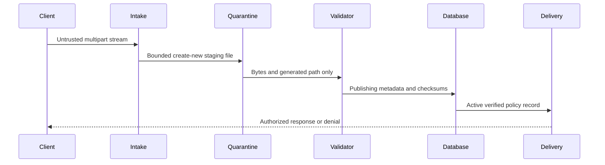
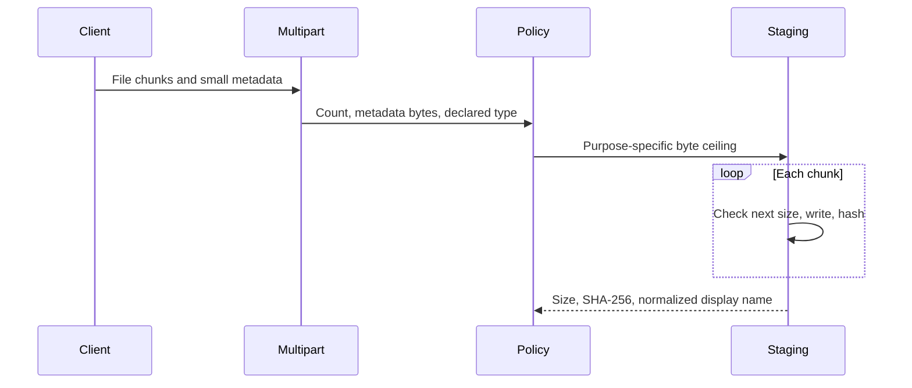
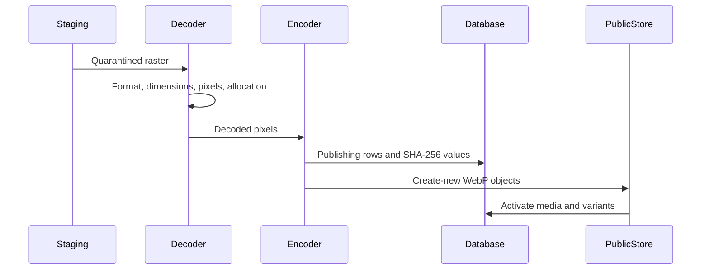
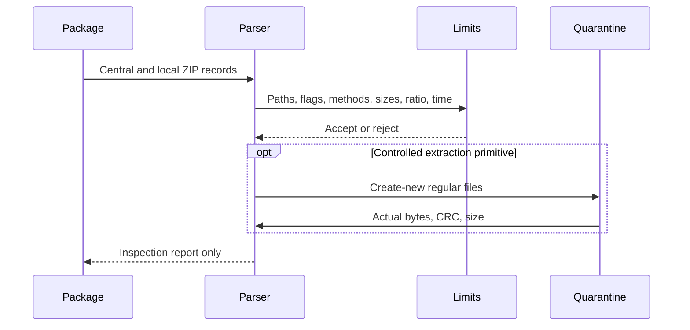
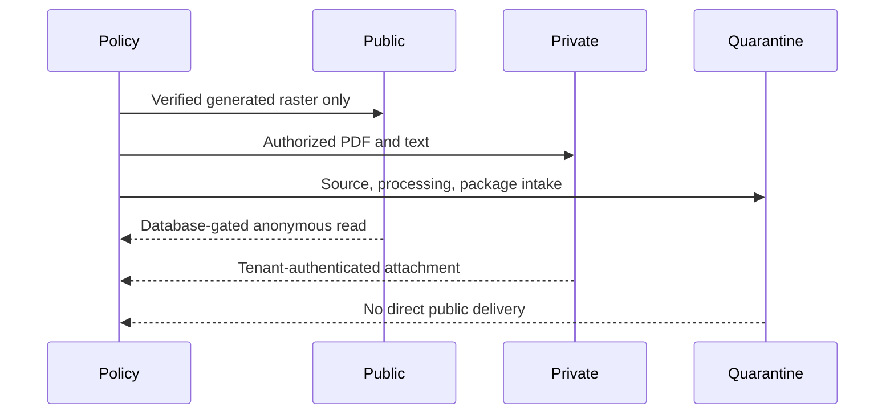
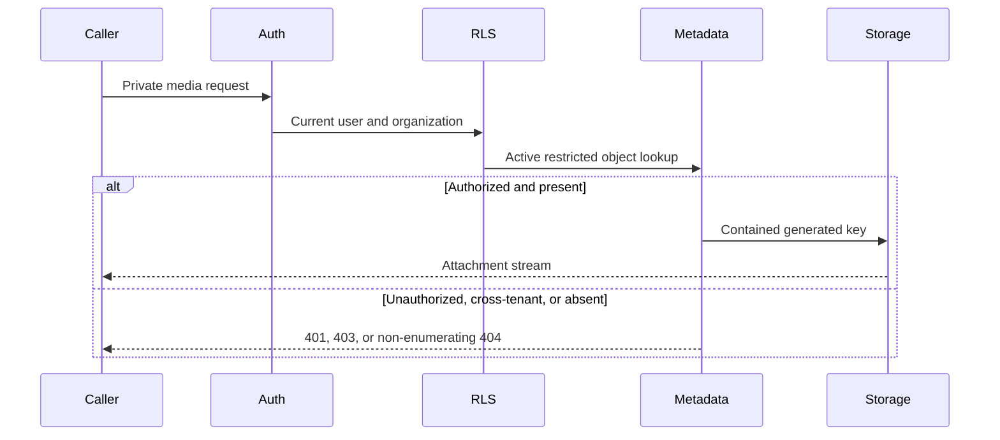
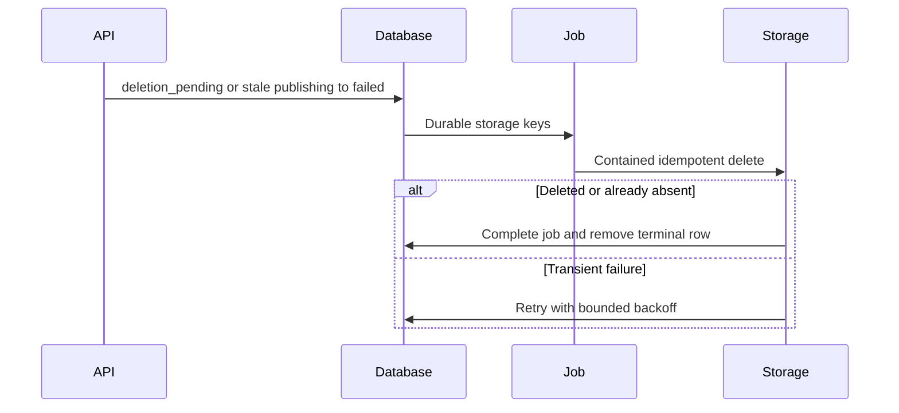

# Phase 7 File Upload and Storage Hardening

## Scope

Phase 7 hardens every repository-backed runtime file intake and delivery
boundary: tenant media uploads, generated image variants, authenticated file
downloads, public image delivery, Marketplace package intake, local storage
namespaces, quotas, retention, cleanup, and production filesystem posture.

The phase preserves the Phase 1-6 authentication, forced-RLS, session, CSP,
Trusted Types, and Step-Up controls. It does not introduce avatars, backup
restore, direct-to-object-store uploads, a CDN, signed URLs, or executable
Marketplace packages.

## Starting Repository State

Work started on `security/security-audit-fixes` at
`518f74a1b0da5c4ee37c14e2a37a716707468410`. The index and working tree were
clean, Phase 6 was committed, and no branch switch, staging, commit, push,
history rewrite, deployment, production access, or owner-environment migration
occurred.

The repository and Git state were treated as authoritative after reading
`AGENTS.md`, `HANDOFF.md`, the complete Phase 1-6 reports, and the Phase 7
requirements.

## Inherited Findings

- `SEC-P01-004` recorded that a broad public `ServeDir` exposed Marketplace
  objects outside entitlement checks. Phase 1 narrowed path shapes; Phase 7
  replaces the shared static mount entirely with database-authorized delivery.
- `SEC-P01-015` and `SEC-P01-018` remain the authoritative CI/advisory-scanner
  gaps. This phase does not invent replacement identifiers.
- `SEC-P01-019` remains the deployment-verification boundary for TLS, HSTS,
  cloud storage, backup, firewall, and real secret injection.
- `SEC-P05-007` remains the owner action for any existing application database
  role that still has `SUPERUSER` or `BYPASSRLS`. All Phase 7 live database
  tests used a disposable `NOSUPERUSER NOBYPASSRLS` role.

## File and Media Surface Inventory

| Surface | Input | Storage/delivery before Phase 7 | Phase 7 disposition |
| --- | --- | --- | --- |
| `POST /api/media/upload` | JPEG, PNG, WebP, PDF, text plus display metadata | Complete multipart part buffered; raw file written below shared public root | Bounded disk stream; raster re-encode to public namespace; PDF/text restricted |
| Generated media variants | Decoded tenant raster | Files below shared public root | Verified WebP derivatives with checksums and lifecycle state |
| `GET /uploads/...` | Generated path | Broad filesystem service after path-shape middleware | Database-gated active/verified public raster delivery only |
| `GET /api/media/{id}/download` | No prior equivalent | PDF/text relied on unguessable public URLs | Authenticated tenant/RLS attachment delivery |
| Marketplace version upload | ZIP and manifest | Complete package buffered; custom central-directory check; persisted artifact | Bounded stream to quarantine; strict archive inspection; reviewed-state gate |
| Marketplace install/update/rollback | Stored ZIP data | Size and SHA-256 recheck | Same checks plus reviewed artifact-state requirement |

`avatar_url`, Marketplace screenshots, template asset mappings, backup/restore
documentation, and creator CLI archives are references or tooling surfaces, not
additional server upload handlers. No direct S3-compatible, cloud object-store,
presigned-upload, scanner, CDN, or restore endpoint exists in this repository.

## File Trust Model

Client names, declared MIME values, extensions, metadata, archive paths, and
archive size declarations are untrusted. Server-generated storage keys are
identifiers, not authority. Database lifecycle, tenant authorization, byte
validation, parser results, checksums, and storage containment must all agree
before delivery.

## Upload Policy

The central policy in `file_security.rs` separates purposes:

| Purpose | Maximum source size | Accepted byte-derived kinds | Public inline |
| --- | ---: | --- | --- |
| Public image | 10 MiB | JPEG, PNG, WebP | Only after decode and WebP re-encode |
| Private document | 25 MiB | structurally checked PDF, complete valid UTF-8 text | No |
| Marketplace package | 50 MiB | inspected ZIP | No |

The application-wide ceiling is validated at startup between 1 MiB and 50 MiB.
Multipart part count is limited to 1-16 and aggregate metadata to 1-65,536
bytes. Purpose limits remain authoritative even if the deployment ceiling is
higher.

## Streaming and Resource Limits

Media and Marketplace handlers no longer call full-part `bytes()`. Chunks are
written to create-new temporary files while size and SHA-256 are updated. Empty
files, excess parts, excess metadata, overflow, and policy-limit violations
fail before publication. Text is validated incrementally across UTF-8 chunk
boundaries.

Image dimensions, total pixels, decoder allocation, encoded output, and variant
count are bounded. Archive parsing has entry, path, compression, expanded-size,
nesting, and wall-clock limits. The image controls use the upstream
[`image::Limits`](https://docs.rs/image/latest/image/struct.Limits.html) and
[`ImageReader`](https://docs.rs/image/latest/image/struct.ImageReader.html)
interfaces.

## Filename and Storage-Key Policy

Client filenames are display metadata only. Normalization takes the final leaf,
removes CR/LF, quotes, separators, path/control/bidirectional characters,
collapses unsafe runs, applies a length bound, and prefixes Windows reserved
device names. `Content-Disposition` uses a safe ASCII fallback plus encoded
UTF-8 metadata.

All storage keys are generated from a fixed namespace, tenant or creator
identity, UUIDs, controlled variants, version data, and SHA-256. A client never
chooses a filesystem-relative destination.

## Path Traversal Protection

Containment rejects absolute paths, drive/colon forms, backslashes, NUL,
percent-encoded ambiguity, empty segments, `.` and `..`. Existing symlink and
Windows reparse-point components are rejected before filesystem operations.
Publication uses create-new semantics and refuses overwrite.

Archive paths add rejection for rooted Unix/Windows names, traversal at any
depth, encoded traversal, links, device/special files, duplicate names,
case-insensitive collisions, excessive depth/length, and conservative
non-ASCII ambiguity. Tests cover Unix, Windows, encoded, and absolute escape
forms.

## Temporary File Security

Source streams use `quarantine/tmp/<uuid>.part`; image derivatives use
`quarantine/processed/<media-uuid>`. Unix staging files/directories request
`0600`/`0700`. File handles are closed before drop cleanup so cancellation also
works on Windows.

Stale source files and processing directories are removed in bounded batches.
Processing cleanup accepts only UUID directories containing the known generated
WebP filenames, rejects links/reparse points and unexpected contents, and does
not recursively delete arbitrary trees.

## MIME and Content Validation

Declared multipart MIME is advisory and must match the byte-derived type, with
an explicit `application/octet-stream` compatibility path only after content
detection. Raster inputs must decode successfully. PDF must have a supported
header/version, line termination, and terminal `%%EOF` with no non-whitespace
suffix. Text must be valid UTF-8 over the complete stream and contain no NUL.
ZIP must pass the archive parser.

Extensions do not establish type. Malformed images, malformed PDF structure,
invalid late UTF-8, declared/actual mismatches, unknown binary data, SVG, HTML,
and scripts are rejected.

## Image Processing

JPEG, PNG, and WebP source bytes remain quarantined. The decoder enforces
8,192-by-8,192 dimension ceilings, 40 million pixels, and 192 MiB allocation.
Decoded pixels are re-encoded to WebP for the original and four bounded
variants. Metadata-bearing source bytes are never published.

## Active File and SVG Policy

SVG and HTML are explicitly detected and rejected from media intake. No
uploaded script, HTML document, SVG, archive member, or Marketplace code is
executed. PDF and text are restricted attachments, not public inline content.
The file response applies `nosniff` and a route-specific
`default-src 'none'; sandbox` CSP; the global security middleware now preserves
that stricter route policy rather than overwriting it.

## Archive Extraction Policy

Marketplace ZIP is parsed from quarantine without trusting central-directory
metadata alone. Only stored and deflate entries are accepted. The parser rejects
encryption, unsupported flags/methods, ZIP64, multi-disk structure, overlaps,
local/central mismatch, links/special files, nested archives, unsafe names, and
CRC/actual-size mismatch.

The production Marketplace path inspects but does not extract or execute
packages. A quarantine extraction primitive exists for tests/future controlled
use and deletes the entire partial output on failure. Policy follows the
[PKWARE ZIP format specification](https://pkware.cachefly.net/webdocs/casestudies/APPNOTE.TXT)
and defense-in-depth guidance from the
[OWASP File Upload Cheat Sheet](https://cheatsheetseries.owasp.org/cheatsheets/File_Upload_Cheat_Sheet.html).

## Decompression Bomb Protection

Marketplace defaults allow at most 500 entries, 25 MiB per expanded entry,
100 MiB total expanded bytes, a 100:1 per-entry ratio, 16 path segments, 240
path bytes, zero nested archives, and ten seconds of processing. Arithmetic uses
checked or saturating bounds; declared sizes are verified against actual
decompressed bytes and CRC.

An entry with zero compressed bytes and nonzero expanded size, excessive
declared expansion, size mismatch, or processing timeout is rejected.

## Marketplace Package Boundary

Marketplace upload streams exactly one package and bounded manifest metadata.
The artifact is stored only in `quarantine/marketplace/...`, with SHA-256,
source size, archive-inspection metadata, scanner status, retention fields, and
`quarantined` state. Review approval moves the database state to `reviewed` and
sets verification time; blocked/rejected outcomes cannot become installable.

Install, update, and rollback require a reviewed stored artifact and continue
to recheck size and SHA-256. Existing packages are classified
`legacy_unverified` and require an explicit review decision.

## Storage Namespace Design

Namespaces are:

- `public/media/<organization>/<media>/...` for verified generated WebP;
- `private/media/<organization>/<media>/...` for restricted documents;
- `quarantine/tmp/...` and `quarantine/processed/...` for transient data;
- `quarantine/marketplace/<creator>/<listing>/<version>/<sha256>.zip` for
  packages.

## Tenant and Object-Level Authorization

Media metadata, restricted delivery, lifecycle updates, cleanup jobs, and quota
queries use tenant context and forced RLS. Every query also carries the
organization identifier where applicable. Cross-tenant object lookup returns
non-enumerating `404`, demonstrated in both directions between live disposable
tenants and in the restricted-role migration test.

Public delivery does not trust an opaque URL alone: it queries by organization,
media UUID, exact storage key, public visibility, verified status, and active
lifecycle.

## Download Authorization

Restricted documents require a valid current access session, active tenant
membership, organization context, forced-RLS visibility, matching media ID, and
active restricted record. Public raster delivery needs no session but still
requires the verified active database record. There is no direct private or
quarantine filesystem mount.

## Signed URL Policy

No signed URL is introduced because the repository has no object-store
delivery boundary. Private files stay behind the application authorization
route. If object storage is added later, signatures must be short-lived,
method/object/tenant bound, non-reusable where practical, generated only after
current authorization, and excluded from logs, history, analytics, and
persistent browser storage.

## File Response Headers

Private responses use the validated content type, safe attachment disposition,
exact length, `Cache-Control: private, no-store, max-age=0`, `Pragma:
no-cache`, `X-Content-Type-Options: nosniff`, CSP sandbox, and no range support.
Public verified WebP uses inline disposition, exact type/length, immutable
public caching, `nosniff`, CSP sandbox, and no range support.

The layered E2E test found that global middleware initially overwrote the
route-specific CSP. Middleware now inserts the default CSP only when a route
has not already selected a stricter policy; a regression test covers the final
layering behavior.

## Range Request Policy

Range serving is not needed for the accepted media set and can create parser,
cache, and authorization inconsistencies. Any `Range` request returns `416
Range Not Satisfiable`, `Content-Range: bytes */<length>`, and
`Accept-Ranges: none`. Whole-object streaming remains bounded by the stored
length and the request timeout.

## File Metadata Security

Display name, alt text, and caption are bounded, normalized, and rendered by
React as text. Tenant identity is derived from authenticated middleware, never
from a file field or frontend form. Physical host paths, quarantine paths,
temporary names, scanner details, cleanup errors, and raw source names are not
returned.

Responses expose only product metadata needed by the UI: opaque IDs, safe
display name, logical URL, verified MIME, size, visibility, verification, and
lifecycle state.

## Integrity and Checksums

SHA-256 is calculated during source streaming. Generated image files receive
independent SHA-256 and size values. Migration constraints require valid
lowercase 64-character digests for verified records. Marketplace artifacts
retain their content-addressed key and install-time size/SHA-256 recheck.

Checksums provide integrity and stable reconciliation identifiers; they are not
treated as authentication, malware verdicts, or secrets.

## Malware Scanning Boundary

A scanner abstraction and explicit states (`pending`, `clean`, `infected`,
`error`, `unavailable`) are present. The current implementation deliberately
returns `unavailable`, never falsely `clean`. Images are parser-normalized;
documents are restricted attachments; packages remain quarantined and cannot
install until reviewed.

No antivirus engine or external scanning service is configured. Operators that
require malware guarantees must integrate one, fail closed for the selected
file classes, define retry/timeout/retention behavior, and monitor backlog and
scanner health.

## Quotas and Abuse Prevention

Upload size, multipart structure, image decoding, archive expansion, request
timeout, and organization rate limits bound individual abuse. Media quota now
locks the organization row and sums `publishing`, `active`, and
`deletion_pending` bytes in the same transaction as the new publishing row.
The live concurrent test proves that only one of two near-limit reservations
succeeds.

Quota accounting uses stored generated image bytes and restricted document
bytes. Cleanup-pending data remains charged until lifecycle completion so
delete/re-upload races cannot overcommit capacity.

## Retention and Cleanup

Deletion first marks media and variants `deletion_pending` and enqueues durable,
tenant-RLS cleanup jobs. Filesystem success or not-found is idempotently
complete; transient errors retry with bounded backoff and stable error codes.
Rows are deleted only after every object job completes.

Synchronous publication failure marks `failed` and enqueues rollback. A
tenant-scoped reconciler locks publishing rows older than 15 minutes, marks
them failed, and enqueues every final key. Bounded stale source/processing
cleanup covers crash remnants. These paths run opportunistically during upload;
a trusted scheduled worker remains an operational requirement.

## Container and Filesystem Permissions

The production backend remains non-root as UID 10001. The runtime binary is
read/execute-only; application and upload directories are owned narrowly.
Production Compose adds a read-only root filesystem, `init`, all capability
drop, `no-new-privileges`, and a `tmpfs` with `noexec,nosuid,nodev`; only the
dedicated upload volume is writable.

Both Compose files render successfully with validation-only values. BuildKit
Dockerfile policy checking completed with no warning.

## Frontend Upload Behavior

The media page uses accept lists as advisory UX only and enforces a 25 MiB
client selection ceiling without weakening server limits. It prevents duplicate
submission, supports `AbortController` cancellation and unmount cleanup, and
does not place bytes or credentials in URLs or persistent state.

Only verified public raster media renders inline. Restricted and legacy media
use authenticated Blob downloads; object URLs are revoked. Server rejection
text and filenames render as React text. Focused tests cover filtering,
oversize, cancellation, duplicate prevention, public/private rendering, Blob
cleanup, and safe error rendering.

## Database Migration Strategy

Migration `0030_security_phase_seven_file_storage.sql` is additive. It adds
storage keys, source/stored digests, source size, visibility, verification,
scanner and lifecycle states, security metadata, publication/retention/deletion
timestamps, variant state, Marketplace artifact state, indexes, and constraints.
It creates forced-RLS `file_cleanup_jobs`.

Upgrade classifies every legacy media/artifact as restricted,
`legacy_unverified`, and scanner-unavailable. It preserves legacy object keys
where the old generated path is safe and otherwise uses a nonpublic unresolved
key. Fresh and 0029-to-0030 upgrade tests both pass under a restricted role.

## Compatibility Impact

- Existing raw image URLs stop being authoritative; only active verified public
  generated WebP records are anonymously delivered.
- Legacy PDF/text URLs become authenticated attachments and are no longer
  public. Clients must use the media download route.
- Original raster bytes and embedded metadata are not preserved publicly;
  output type changes to WebP and quota reflects generated bytes.
- Legacy Marketplace versions become non-installable until explicitly reviewed.
- Range requests receive 416.
- Production containers need the dedicated writable upload volume and new
  bounded upload environment settings.

## Confirmed Phase 7 Findings

| ID | Severity / status | Evidence and impact | Resolution |
| --- | --- | --- | --- |
| `SEC-P07-001` | High / Confirmed | Broad filesystem delivery made PDF/text media public by unguessable URL and did not consult object authorization; initial final-response testing also caught route CSP overwrite | Removed `ServeDir`; added database-gated public raster and tenant/RLS private attachment routes, safe headers, and layered CSP regression |
| `SEC-P07-002` | High / Confirmed | Both upload handlers buffered full multipart files; image decode lacked explicit dimension/allocation limits, allowing authorized memory/CPU exhaustion | Disk streaming, purpose limits, full-content validation, image allocation/pixel limits, re-encode, archive size/ratio/time limits |
| `SEC-P07-003` | Medium / Confirmed | Quota was read-then-check and filesystem/database publication or deletion could leave overcommit, orphan, or missing-object state | Locked atomic quota reservation, lifecycle state, durable cleanup jobs, rollback, stale-publishing reconciliation, bounded quarantine cleanup |

No Critical, Low, or Informational Phase 7 finding was confirmed.

## Earlier Findings Closed

The `SEC-P01-004` closure is strengthened and completed for the current
repository boundary: there is no shared static upload mount, Marketplace and
quarantine namespaces have no public route, and even public media requires an
active verified database record.

No claim is made that `SEC-P01-015`, `SEC-P01-018`, `SEC-P01-019`,
`SEC-P05-007`, or their operational portions are closed.

## Changes Applied

- Added central file policy, secure staging, filename/disposition, storage-key,
  path/link, PDF/text, archive, scanner, checksum, and stale-quarantine services.
- Rebuilt media intake/delivery around streaming, raster normalization,
  lifecycle publication, tenant authorization, secure headers, atomic quota,
  cleanup jobs, and reconciliation.
- Rebuilt Marketplace intake around streamed quarantine and strict ZIP
  inspection; added reviewed artifact gates.
- Added migration 0030, deployment hardening, configuration validation, API and
  architecture documentation, OKF security/configuration updates, and frontend
  upload/download behavior.
- Added focused backend migration/filesystem/archive/image tests and MediaPage
  tests.

## Validation Results

Successful checks:

- `cargo fmt --all -- --check`;
- `cargo clippy --offline --all-targets --all-features -- -D warnings`;
- `cargo test --offline --all-features`;
- 17 focused Phase 7 file/archive/image/cleanup tests;
- two live restricted-role migration tests for fresh and upgrade databases,
  including forced RLS, cross-tenant denial, concurrent quota, legacy
  classification, and stale-publication reconciliation;
- frontend lint, typecheck, 58 tests in 13 files, production build, and the
  one-approved-HTML-sink policy;
- live disposable HTTP checks for private/public upload and delivery, unsafe
  filename handling, anonymous denial, headers, Range, SVG, MIME mismatch,
  image normalization, two-way cross-tenant IDOR, and temporary cleanup;
- local and production Compose rendering, BuildKit Dockerfile check, and
  `git diff --check`.

The frontend build retains the known nonblocking chunk-size warning.

## Browser Verification

No browser result is reported as passed. The mandatory in-app Browser runtime
failed before any browser command with an internal kernel-asset path error, and
the same failure remained after the documented reset/retry path.

The live HTTP test validates server behavior but is not presented as browser
evidence. Frontend unit tests cover upload cancellation, duplicate prevention,
safe text rendering, Blob download/revocation, and inline-image policy. Browser
cookies, local storage, profiles, passwords, and session stores were not
inspected because the Browser skill explicitly prohibits that inspection.

## Failed or Unavailable Checks

- In-app browser verification was unavailable because the Codex browser runtime
  could not create its internal assets. No fallback standalone browser
  automation was used.
- `cargo audit` is unavailable because the subcommand is not installed.
- Adding a new exact ZIP crate was unavailable after the registry request
  failed DNS/network access. The implementation instead uses locked cached
  `flate2` and `crc32fast` dependencies with a strict purpose-built reader.
- `npm audit --omit=dev` was not run because it would transmit the dependency
  graph to external advisory infrastructure without separate authorization.
- No real antivirus, S3-compatible store, signed URL, CDN, production ingress,
  backup/restore, or owner filesystem was available for validation.

Initial validation iterations also exposed and fixed Clippy warnings, PowerShell
harness compatibility, multipart harness formatting, and the real final-layer
CSP overwrite. None is represented as a final passing check until its corrected
test succeeded.

## Operational Requirements

1. Back up database and storage, test restore, then apply migration 0030 in an
   approved non-production environment.
2. Verify the application role is `NOSUPERUSER NOBYPASSRLS` in every existing
   environment and review forced-RLS behavior.
3. Migrate legacy public URLs/clients to authenticated downloads and explicitly
   review legacy Marketplace artifacts before installation.
4. Provision a dedicated persistent upload volume with the tracked ownership,
   read-only root filesystem, and capacity/inode monitoring.
5. Run cleanup/reconciliation in a trusted scheduled worker, alert on retry,
   failed, stale publishing, scanner, and quarantine backlogs, and approve
   retention/legal policy.
6. Integrate a supported malware scanner if the risk model requires a clean
   verdict; keep `unavailable` distinct until then.
7. Re-run real browser, ingress, object-store/CDN, and backup/restore validation
   in the target deployment.

## Residual Risks

- Filesystem containment is defense in depth, not a substitute for host
  ownership: a privileged local attacker can race or alter storage outside the
  application's trust model.
- Cleanup and stale-publication reconciliation are opportunistic until a trusted
  scheduler is wired; inactive tenants can retain stale objects longer.
- Marketplace persistence and relational commit cannot be atomic on a local
  filesystem; synchronous failures are removed, but crash-only orphan scanning
  needs an operational worker.
- Scanner status is explicitly unavailable, so restricted documents and
  reviewed packages do not carry an antivirus-clean guarantee.
- PDF validation is structural, not a full PDF sanitization/CDR engine.
- UUID/object URLs are opaque and collision resistant but public image URLs are
  bearerless once the database policy marks them public.
- Browser behavior remains unverified in this run.

## Deferred Areas

Direct object-store upload, signed URL issuance, CDN cache invalidation, content
disarm and reconstruction, antivirus integration, archive extraction in
production, avatar upload, backup restore, legal hold, global orphan scanning,
and production performance/chaos tests are deferred.

Automated dependency advisory gates remain under `SEC-P01-015` and
`SEC-P01-018`. Deployment TLS/HSTS/firewall/backup/secret controls remain under
`SEC-P01-019`. Existing-role remediation remains under `SEC-P05-007`.

## Recommended Next Phase

Phase 8 should harden audit logging, sensitive-data redaction, observability,
security alert ownership, scheduled security/retention workers, tamper-evident
file lifecycle events, production scanner integration, dependency/container
advisory gates, and performance/chaos behavior for upload, archive, quota,
storage outage, and cleanup paths.
